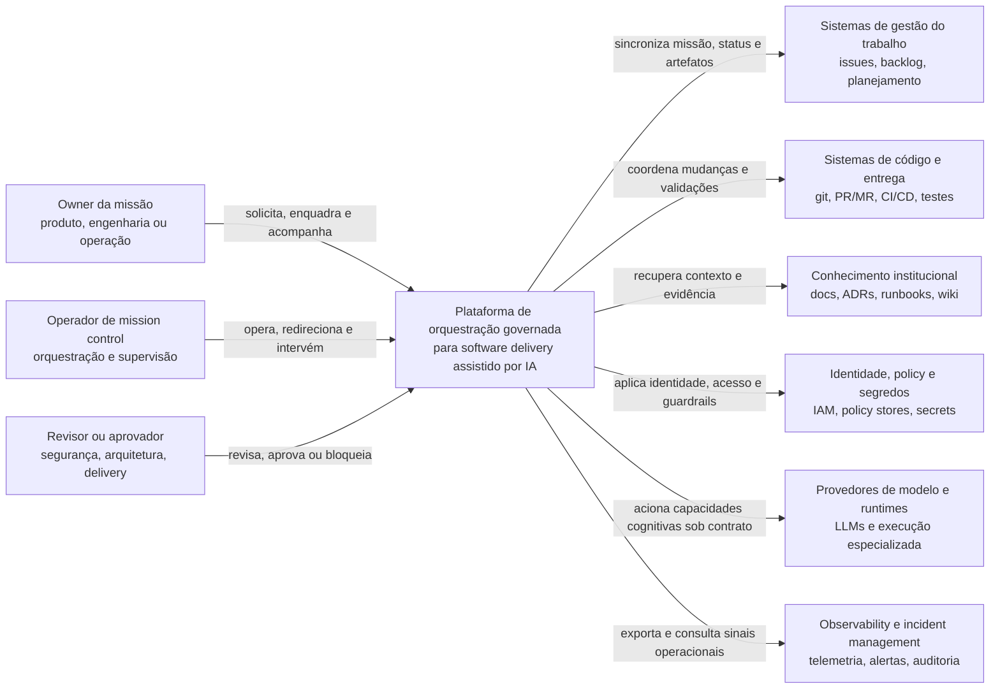
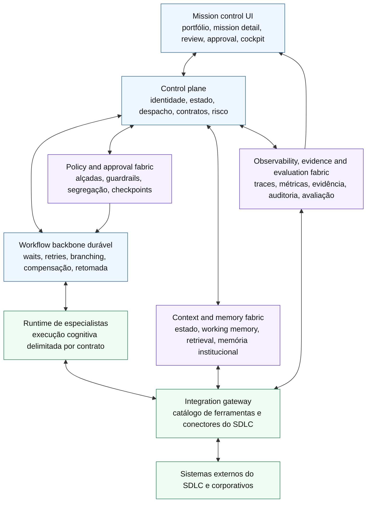
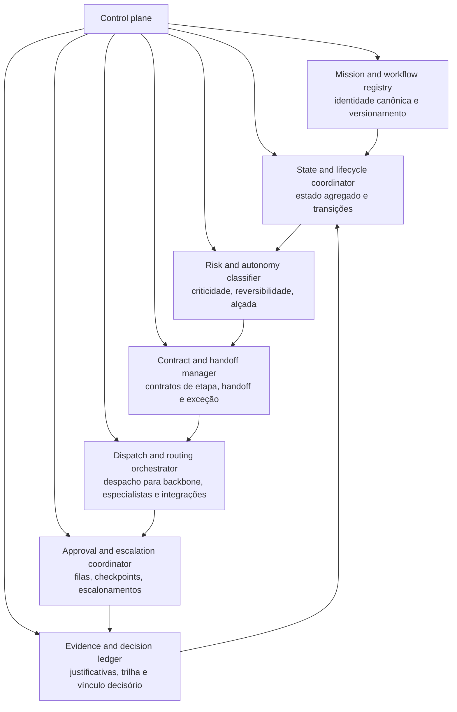
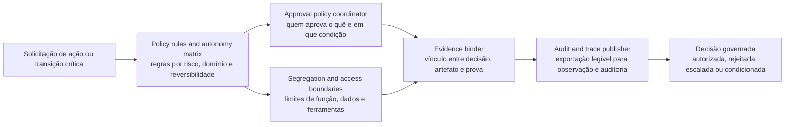

# Arquitetura conceitual em C4

## Objetivo
Traduzir a tese arquitetural do repositório em um conjunto enxuto de diagramas C4, mantendo o nível conceitual e não implementacional desta fase.

## Princípio de leitura
### Regra de escopo
Os diagramas abaixo não descrevem deployment, stack definitiva, protocolos concretos ou componentes técnicos finais. Eles documentam **estrutura conceitual, fronteiras e responsabilidades** da plataforma de orquestração governada.

### Resposta curta
A leitura C4 mais coerente para este repositório é:
1. **System context** para posicionar a plataforma no ecossistema do SDLC
2. **Container view** para mostrar o núcleo control-plane-first e suas bordas pluggable
3. **Component view** para decompor conceitualmente o control plane e o tecido de governança/evidência

## Nível 1, system context

### Pergunta que responde
Que sistema está sendo desenhado, quem interage com ele e quais sistemas externos compõem seu contexto operacional?

### Leitura do contexto
- a plataforma é o **sistema de interesse**
- humanos interagem com ela por papéis distintos, não por um único canal indiferenciado
- sistemas externos permanecem estruturalmente relevantes, mas fora do núcleo semântico
- provedores de modelo e runtimes entram como capacidade integrada, não como centro administrativo

## Nível 2, container view conceitual

### Pergunta que responde
Quais blocos principais compõem a plataforma e como eles cooperam para coordenar trabalho, governança e supervisão humana?

### Leitura dos contêineres conceituais
- **control plane** é o centro administrativo do sistema
- **workflow backbone** sustenta durabilidade operacional e estados longos
- **runtime de especialistas** executa trabalho, mas não governa política nem estado canônico
- **policy, memory e observability** aparecem como tecidos transversais, não como apêndices
- **integration gateway** mantém a relação com o ecossistema real sem dissolver a identidade da plataforma

## Nível 3, component view conceitual do control plane

### Pergunta que responde
Que capacidades internas precisam existir no núcleo do control plane para a plataforma manter coordenação governada e auditável?

### Leitura da decomposição do control plane
- o núcleo não é um bloco genérico de “coordenação”, mas um conjunto de responsabilidades discerníveis
- identidade, risco, contrato, despacho, aprovação e evidência formam uma cadeia única
- o vínculo entre **decisão** e **estado** é explícito, evitando automação opaca

## Nível 3 complementar, componentes conceituais de governança e evidência

### Pergunta que responde
Como a plataforma conecta guardrails, aprovação e explicabilidade sem reduzir isso a lógica dispersa em fluxos locais?

### Leitura da governança transversal
- a decisão governada nasce da combinação entre **policy**, **alçada**, **acesso** e **evidência**
- aprovação não é evento isolado, mas parte de um fluxo verificável
- auditoria é consequência natural do desenho, não reconstrução posterior

## Relação entre os níveis
### Inferência
Os quatro diagramas se encadeiam assim:
- o **contexto** mostra por que a plataforma existe no ecossistema
- os **contêineres** mostram a forma macro control-plane-first
- os **componentes do control plane** mostram onde reside a semântica própria
- os **componentes de governança e evidência** mostram o tecido que impede o sistema de virar automação opaca

## Limites intencionais desta documentação
### Regra de fase
Esta documentação ainda não define:
- tecnologias mandatórias de implementação
- topologia de deployment
- contratos de API finais
- particionamento físico de serviços
- modelo definitivo de dados
- escolha final entre frameworks substituíveis de runtime, workflow ou observabilidade

## Conclusão
### Proposta conceitual
A principal contribuição do C4 nesta fase é **tornar a arquitetura legível em níveis**, preservando a tese do repositório: plataforma de orquestração governada, control-plane-first, com backbone durável, especialistas subordinados, memória governada, policy explícita e evidência de primeira classe.

## Referências
- `docs/100-software-design/02-system-context-and-boundaries.md`
- `docs/100-software-design/03-views-and-viewpoints.md`
- `docs/40-orchestration/04-target-architecture-proposal.md`
- `docs/40-orchestration/06-platform-blueprint.md`
- `docs/30-framework/03-work-management-model.md`
- C4 Model: https://c4model.com/
