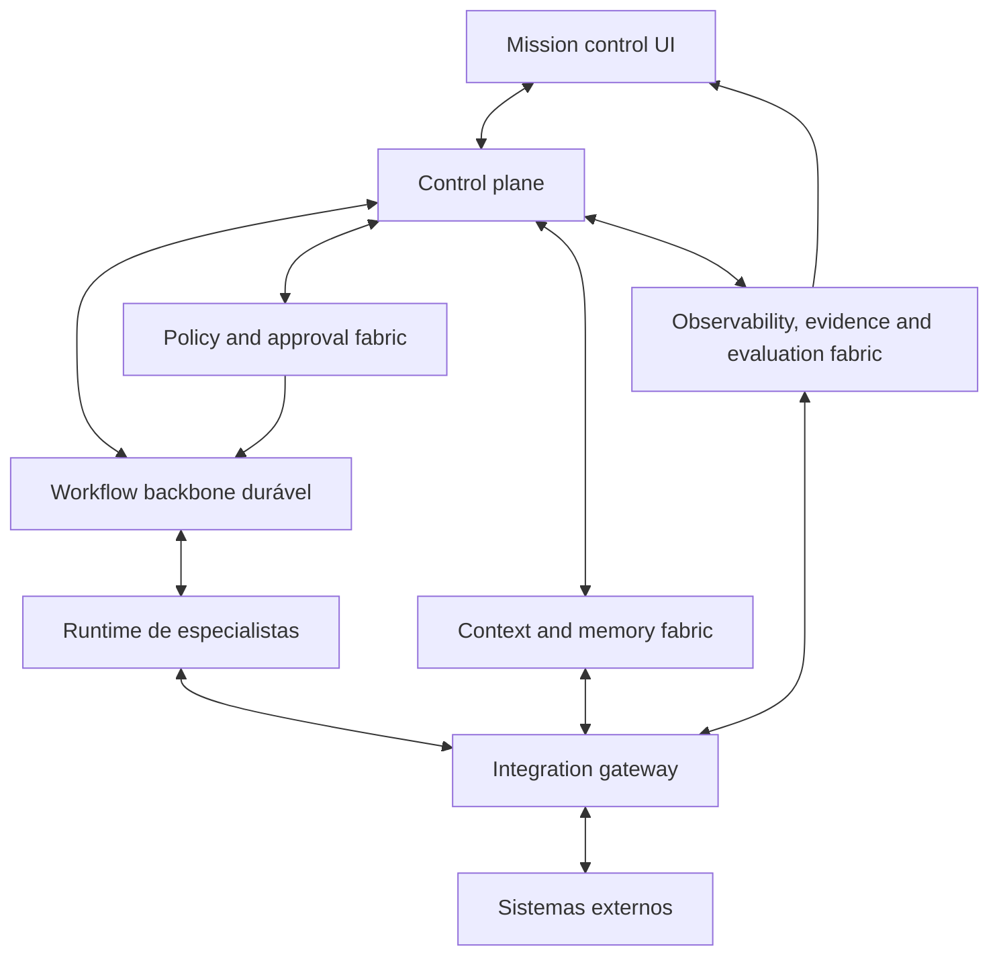

# Índice de contêineres da arquitetura C4

## Objetivo
Transformar a container view conceitual em um mapa navegável de contêineres, deixando explícito o papel de cada bloco principal da plataforma, suas fronteiras e os pontos que ainda precisam de decisão.

## Como ler este índice
Cada contêiner abaixo é descrito como um **bloco conceitual estável**, e não como um serviço físico obrigatório. Em implementação futura, um contêiner pode se materializar como um produto, um serviço, um conjunto de módulos ou uma composição de capacidades.

## Catálogo de contêineres

| Contêiner | Papel estrutural | Documento dedicado |
|---|---|---|
| Mission control UI | Superfície operacional para intake, acompanhamento, review, approval e intervenção | `09-c4-container-mission-control-ui.md` |
| Control plane | Sistema de registro, coordenação semântica, risco, despacho e trilha decisória | `10-c4-container-control-plane.md` |
| Workflow backbone durável | Execução longa, waits, retries, compensações e retomada | `11-c4-container-workflow-backbone.md` |
| Runtime de especialistas | Execução cognitiva e operacional sob contrato e limites de autonomia | `12-c4-container-runtime-de-especialistas.md` |
| Context and memory fabric | Contexto operacional, retrieval, memória institucional e proveniência | `13-c4-container-context-and-memory-fabric.md` |
| Policy and approval fabric | Guardrails, alçadas, segregação, checkpoints e exceções | `14-c4-container-policy-and-approval-fabric.md` |
| Observability, evidence and evaluation fabric | Tracing, métricas, evidência, auditoria e avaliação | `15-c4-container-observability-evidence-evaluation.md` |
| Integration gateway | Contratos de ferramentas e conectores com o SDLC e sistemas corporativos | `16-c4-container-integration-gateway.md` |

## Relações principais entre os contêineres

## Leitura resumida das fronteiras
- a **UI** expõe o sistema, mas não vira fonte canônica de estado
- o **control plane** governa significado, identidade, decisão e coordenação
- o **workflow backbone** garante continuidade operacional e progressão durável
- o **runtime de especialistas** executa trabalho delimitado e devolve saídas sob contrato
- **contexto**, **policy** e **observabilidade** atravessam o sistema como tecidos estruturais
- o **integration gateway** evita que a semântica da plataforma fique dissolvida dentro de conectores ad hoc

## Perguntas de leitura recomendadas
Para cada contêiner, a documentação abaixo responde a um mesmo conjunto de perguntas:
1. qual problema ele resolve?
2. o que está dentro e fora da sua fronteira?
3. quais entradas recebe e quais saídas produz?
4. quais dados ele possui ou apenas referencia?
5. quais eventos publica ou consome?
6. de que integrações e dependências precisa?
7. que restrições, riscos e sinais operacionais devem ser observados?
8. que decisões arquiteturais ainda permanecem abertas?

## Conclusão
Este índice torna a container view mais operável como artefato de design. Em vez de apenas mostrar caixas, ele organiza o aprofundamento do que cada caixa precisa significar para que a plataforma permaneça control-plane-first, workflow-backed e governada por evidência.
