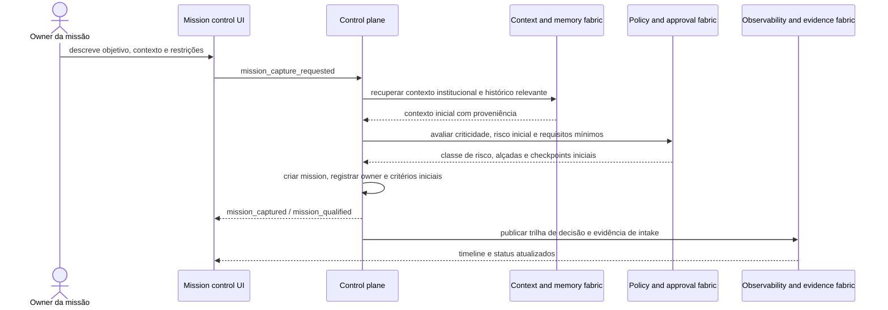
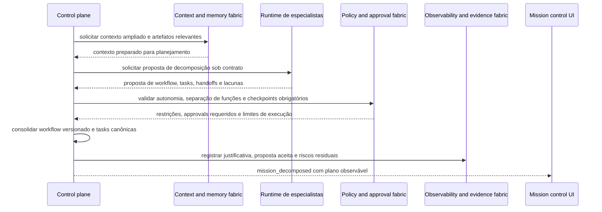
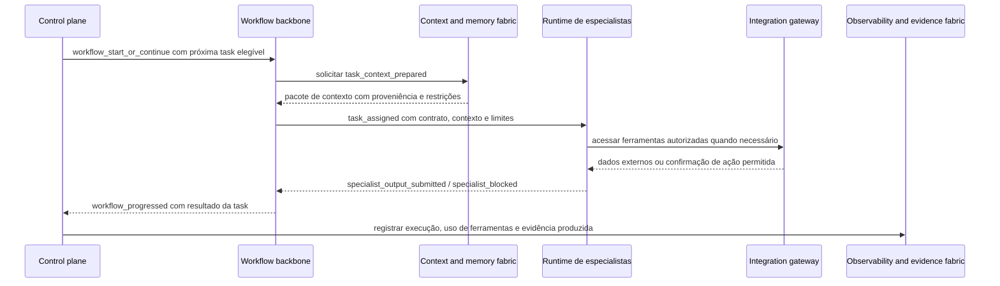
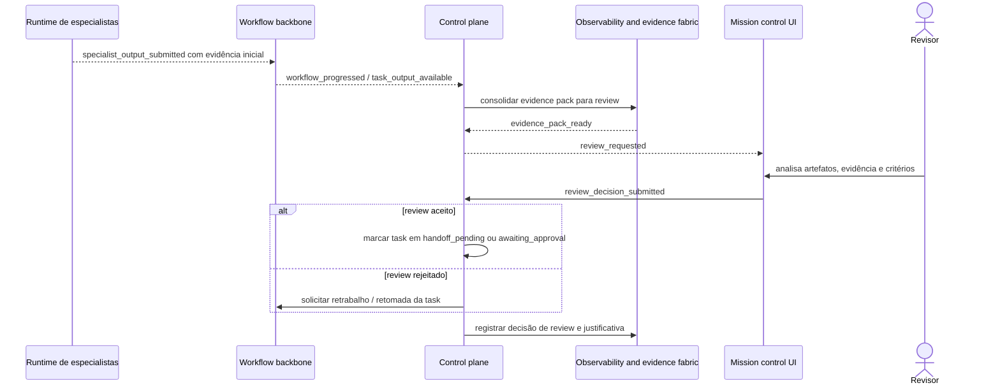
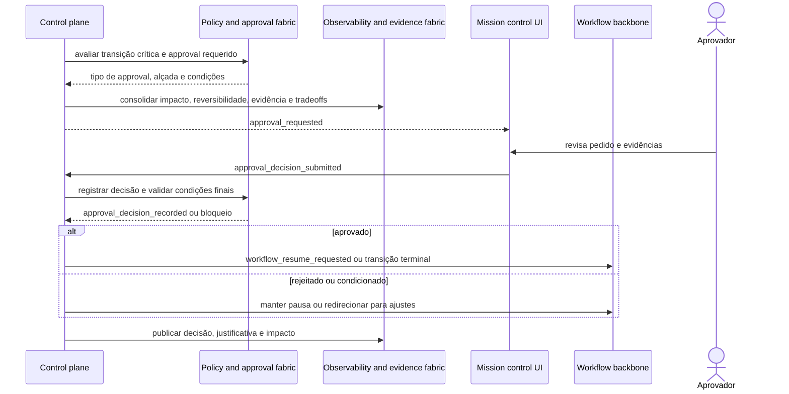
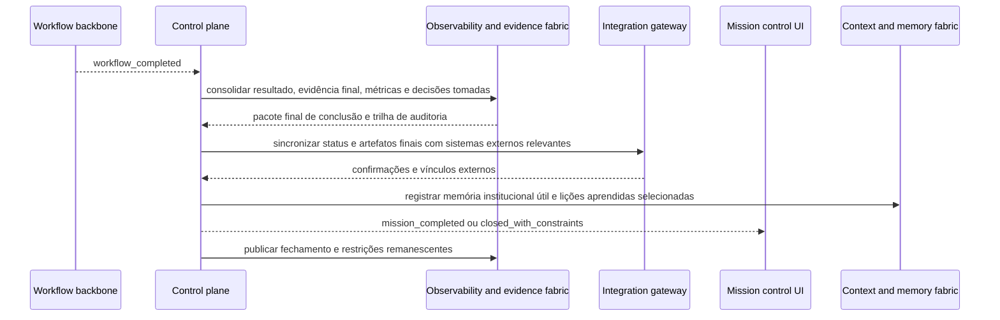

# Runtime views críticas da arquitetura conceitual

## Objetivo
Complementar a estrutura C4 com visões dinâmicas dos fluxos mais críticos da plataforma, mostrando como os contêineres cooperam ao longo do tempo para sustentar trabalho governado.

## Regra de leitura
As runtime views abaixo continuam conceituais. Elas mostram responsabilidades, transições e checkpoints, não protocolos finais nem chamadas de API definitivas.

## Fluxo 1, criação e qualificação de missão

### Pergunta que responde
Como uma intenção inicial vira uma mission qualificada, com identidade, risco inicial e condições mínimas para seguir?

### Leitura do fluxo
- a UI capta intenção, mas a criação formal ocorre no control plane
- contexto e policy entram cedo para evitar intake cego
- a qualificação já produz trilha auditável, não apenas abertura informal

## Fluxo 2, decomposição governada da missão

### Pergunta que responde
Como uma mission qualificada é convertida em workflow, tasks, dependências e checkpoints sem perder rastreabilidade?

### Leitura do fluxo
- especialistas podem propor decomposição, mas não a canonizam sozinhos
- policy atua sobre o plano antes da execução, não apenas depois do risco materializado
- a decomposição precisa produzir rastreabilidade entre objetivo superior e cada task

## Fluxo 3, delegação de task para especialista

### Pergunta que responde
Como uma task pronta é delegada com contexto suficiente, limites claros e retorno estruturado?

### Leitura do fluxo
- o backbone coordena a execução durável, mas o control plane continua lendo o resultado em termos de domínio
- contexto chega preparado e governado, em vez de acesso livre a tudo
- ações externas passam pelo integration gateway, não diretamente pelo especialista

## Fluxo 4, review de saída relevante

### Pergunta que responde
Como uma entrega produzida vira objeto formal de review e retorna para retrabalho ou segue adiante?

### Leitura do fluxo
- review é ato formal sustentado por evidence pack, não simples comentário difuso
- o resultado do review pode gerar retrabalho ou avançar a missão
- a decisão fica vinculada à trilha observável da tarefa e da missão

## Fluxo 5, approval de ação crítica

### Pergunta que responde
Como a plataforma segura uma transição crítica até que a alçada correta autorize o avanço?

### Leitura do fluxo
- approval difere de review porque autoriza a transição, não apenas avalia a qualidade
- policy define a alçada e as condições, mas a autorização material é registrada no fluxo
- o workflow backbone só retoma quando a decisão governada estiver registrada

## Fluxo 6, conclusão e fechamento da missão

### Pergunta que responde
Como a missão chega ao estado de concluída com artefatos finais, evidência, pendências e aprendizado explícitos?

### Leitura do fluxo
- concluir não é apenas terminar execução, mas consolidar resultado verificável
- integração externa e memória institucional entram no encerramento, não só na execução
- o fechamento pode manter restrições explícitas, preservando honestidade operacional

## Síntese das runtime views
As seis visões acima mostram a arquitetura em movimento:
- **criação** transforma intenção em objeto governado
- **decomposição** converte objetivo em plano versionado
- **delegação** aciona especialistas sob contrato e contexto preparado
- **review** compara saída e contrato com evidência acessível
- **approval** controla transições críticas por alçada e risco
- **conclusão** fecha a missão com trilha, sincronização externa e aprendizado

## Relação com o restante da seção
Estas runtime views complementam:
- `05-conceptual-domain-model.md`, ao colocar mission, workflow e task em movimento
- `07-c4-conceptual-architecture.md`, ao sair da estrutura estática para o comportamento
- `08-c4-container-index.md` a `16-c4-container-integration-gateway.md`, ao mostrar cooperação entre contêineres

## Conclusão
A arquitetura C4 do repositório deixa de ser apenas uma fotografia estrutural e passa a incluir os fluxos que mais importam para uma plataforma de orquestração governada: intake, decomposição, delegação, review, approval e completion.
