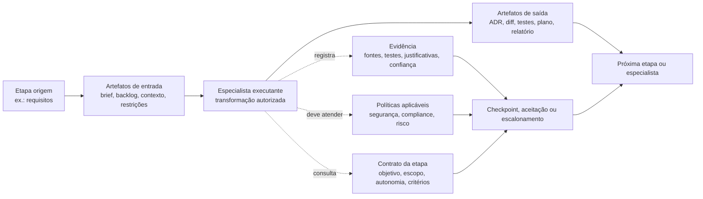

# Artefatos, handoffs e pontos de controle no SDLC assistido por IA

## Objetivo
Traduzir a discussão de orquestração em uma visão operacional do que circula entre etapas, onde a evidência deve ser capturada e onde checkpoints humanos tendem a ser mandatórios.

## Princípio orientador
### Proposta conceitual
O objeto central de coordenação não é a conversa com o modelo, mas o handoff entre estados de trabalho. Cada handoff deve carregar artefatos, metadados de confiança, política aplicável e critério de aceite.

## Mapa resumido por etapa

| Etapa | Artefatos de entrada | Saída esperada | Controles críticos | Natureza predominante |
|---|---|---|---|---|
| Descoberta e escopo | objetivo, restrições, contexto de negócio, priorização | brief estruturado, hipóteses, critérios de sucesso | validação de objetivo, alinhamento com negócio | proposta conceitual |
| Requisitos e planejamento | brief, backlog, incidents, conhecimento prévio | user stories, NFRs, plano de entrega, riscos | aprovação de escopo, completude, dependências | proposta conceitual com apoio em padrões corporativos |
| Arquitetura e desenho | requisitos, políticas, baseline técnica | ADRs, desenho lógico, interfaces, tradeoffs | checkpoint humano obrigatório em mudanças relevantes | inferência forte + proposta |
| Implementação | tickets, desenho, interfaces, padrões de código | diff, módulos, testes unitários, documentação local | lint, testes, policy de secrets, revisão de código | fato observado em plataformas atuais |
| Verificação | diff, testes, requisitos, políticas | relatório de validação, gaps, evidências | cobertura, falhas, risco residual, revisão humana seletiva | fato observado + proposta |
| Build e integração | código, config, dependências | artefatos de build, SBOM, status de pipeline | segurança de supply chain, assinatura, provenance | fato observado |
| Release e deploy | artefatos versionados, evidências, aprovações | release candidate, changelog, rollout plan | aprovação por risco, compliance, rollback plan | inferência forte |
| Operação e aprendizado | telemetry, incidents, feedback do usuário | backlog de melhoria, ajustes de política, memória de fluxo | observabilidade, SLOs, postmortem, revisão de exceções | inferência forte |

## O que as fontes sustentam diretamente

### Fatos observados
- GitHub Code Review opera no objeto pull request, produz comentários, sugestões e sinais de feedback, o que mostra o PR como unidade concreta de handoff entre implementação e revisão. Fonte: GitHub Docs, 2026, https://docs.github.com/en/copilot/how-tos/use-copilot-agents/request-a-code-review/use-code-review
- GitHub descreve leitura de linked issues e pull requests para melhorar a revisão, sugerindo que issue, PR e contexto de repositório formam um pacote operacional mínimo. Fonte: GitHub Blog, 2026, https://github.blog/ai-and-ml/github-copilot/60-million-copilot-code-reviews-and-counting/
- GitLab Software Development Flow usa issues, merge requests, pipelines, jobs e notas via APIs específicas, o que explicita quais artefatos a plataforma trata como contexto e superfície de ação. Fonte: GitLab Docs, 2026, https://docs.gitlab.com/user/duo_agent_platform/flows/foundational_flows/software_development/
- GitLab posiciona merge requests, approvals, telemetry e SBOMs como parte do control plane de entrega. Fonte: GitLab Blog, 2026, https://about.gitlab.com/blog/agentic-sdlc-gitlab-and-tcs-deliver-intelligent-orchestration-across-the-enterprise/
- Atlassian conecta o agente a Jira, Confluence e Bitbucket, o que reforça que ticket, documentação e código precisam circular juntos. Fonte: Atlassian Blog, 2026, https://www.atlassian.com/blog/announcements/rovo-dev-command-line-interface

## Diagrama conceitual, handoffs, contratos e artefatos

### Leitura do diagrama
#### Proposta conceitual
O handoff só é confiável quando a transformação entre artefatos é mediada por contrato, policy e evidência. Sem esse tripé, a passagem entre etapas vira contexto conversacional implícito.

## Contrato mínimo de handoff
### Proposta conceitual
Cada transição entre especialistas ou etapas deve conter:
1. identificador do fluxo e da etapa
2. objetivo local da transformação
3. artefatos obrigatórios de entrada
4. artefatos produzidos na saída
5. políticas aplicáveis
6. critérios de aceite
7. evidência gerada
8. nível de autonomia permitido
9. grau de confiança declarado
10. condição de escalonamento humano

## Tipos de handoff

### 1. Handoff informacional
Transfere contexto, sem autorização para agir.

### 2. Handoff transformacional
Autoriza gerar ou modificar artefatos, mantendo critérios claros de validação.

### 3. Handoff decisório
Exige comparação de opções e registro de decisão, quase sempre com humano no loop.

### 4. Handoff de exceção
Escala risco, ambiguidade, conflito entre evidências ou baixa confiança.

## Pontos de controle recomendados

### Checkpoint humano obrigatório
- aprovação de escopo inicial
- decisões arquiteturais com impacto relevante
- relaxamento de política de segurança ou compliance
- autorização de release em mudanças críticas
- tratamento de incidentes severos
- aceitação de tradeoff entre prazo e risco

### Checkpoint automatizável com auditoria
- validação sintática e estrutural de artefatos
- presença de evidências obrigatórias
- aderência a formato e contrato
- execução de testes e scans
- comparação entre saída e política aplicável

## Anti-padrões a evitar
### Inferência
- handoffs implícitos baseados apenas em contexto conversacional
- saídas livres sem schema nem critério de aceite
- especialistas com autonomia ampla demais e mal delimitada
- falta de distinção entre memória de trabalho, evidência e documentação oficial
- checkpoints humanos tardios, só no final do fluxo

## Implicação para o framework
### Proposta conceitual
A futura arquitetura deve tratar artefato, handoff, contrato, checkpoint e evidência como entidades de primeira classe. Sem isso, a orquestração fim a fim vira apenas encadeamento frágil de prompts.