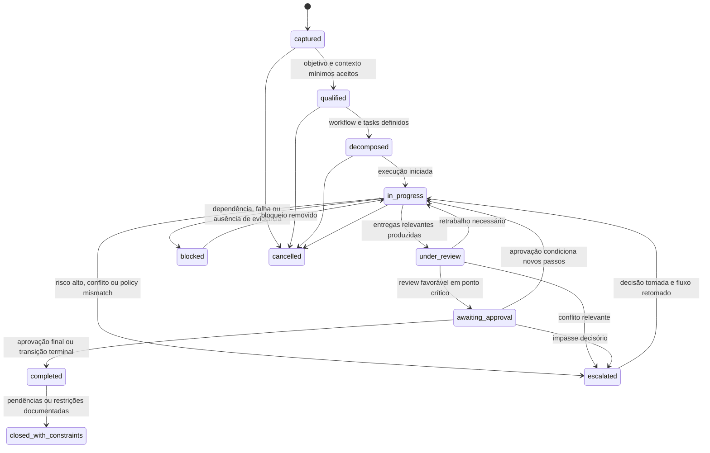
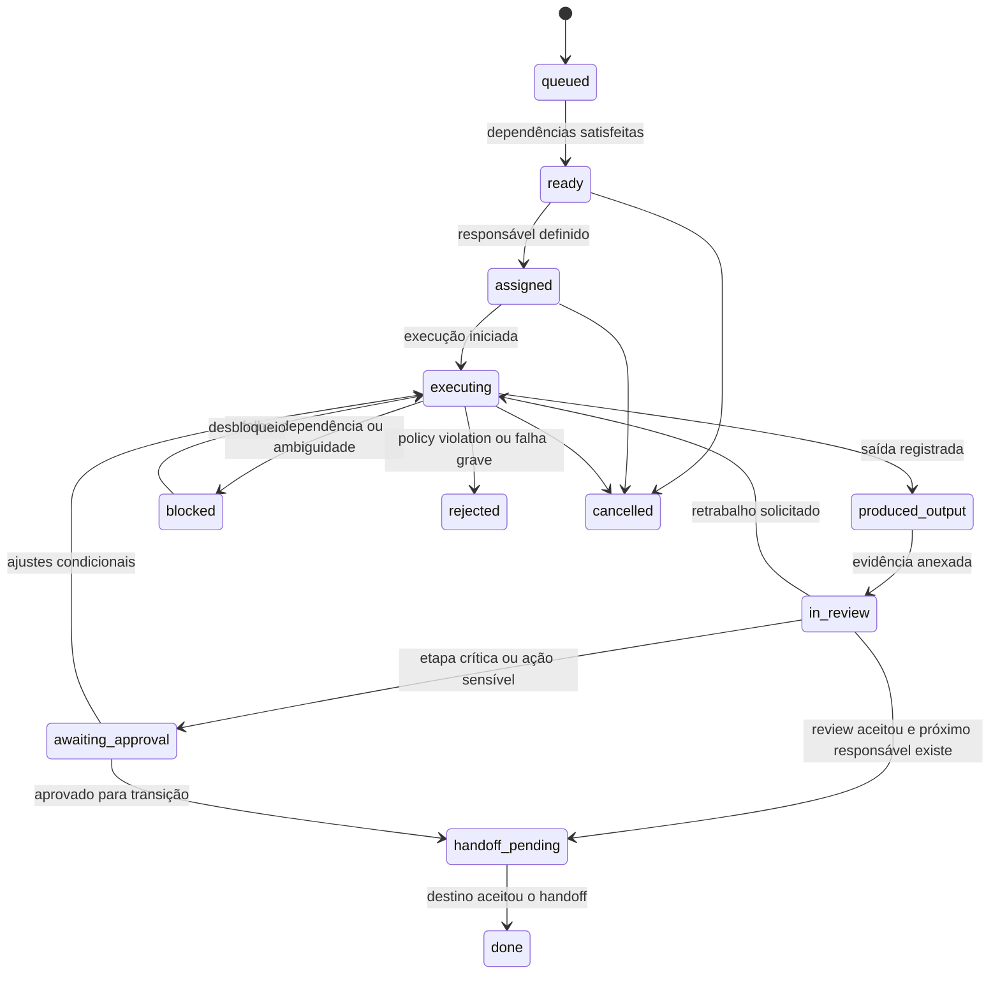

# Modelo de gestão do trabalho acima da orquestração

## Objetivo
Definir a camada conceitual que organiza o trabalho acima do orchestration engine: o modelo operacional da plataforma, seus objetos de domínio centrais e os ciclos de vida mínimos que permitem coordenação, supervisão humana e leitura gerencial do sistema.

## Tese central
### Inferência
Se a orquestração é o plano de controle da execução, a gestão do trabalho é o plano de operação visível do sistema. Ela transforma execuções isoladas em missões legíveis, governáveis e comparáveis ao longo do tempo.

## Papel desta camada
### Proposta conceitual
Esta camada deve responder a cinco perguntas:
1. qual trabalho existe e por que ele existe?
2. como esse trabalho se decompõe em unidades governáveis?
3. quem está responsável por cada unidade em cada momento?
4. quais decisões, revisões, aprovações e handoffs ocorreram?
5. quais artefatos e evidências sustentam o avanço ou o bloqueio?

### Proposta conceitual
Ela não substitui o orchestration engine. Ela o enquadra operacionalmente. Em termos simples:
- o **engine** coordena execução durável, waits, retries e eventos
- o **modelo de gestão do trabalho** organiza intenção, ownership, estado, governança e leitura humana do progresso
- a **UI de mission control** torna esse modelo observável e acionável

## Operating model da plataforma

### Proposta conceitual
O operating model recomendado é orientado a **missão governada**, com decomposição explícita, trabalho observável e supervisão humana seletiva por risco.

### Componentes do operating model
1. **Intake de missão**  
   Captura objetivo, contexto inicial, criticidade, restrições, dono do problema e critérios de sucesso.

2. **Qualificação e enquadramento**  
   Determina escopo, risco, reversibilidade, políticas aplicáveis e necessidade de checkpoints obrigatórios.

3. **Decomposição governada**  
   Converte a missão em workflow, tarefas, dependências, handoffs e resultados esperados.

4. **Execução coordenada**  
   Ativa agentes, especialistas, ferramentas e superfícies do SDLC sob contratos explícitos.

5. **Revisão e decisão**  
   Consolida evidência, compara saída com critérios de aceite e aciona review, approval ou escalonamento.

6. **Conclusão e aprendizado**  
   Fecha a missão com artefatos finais, resultado operacional, pendências, lições aprendidas e impacto observado.

## Objetos de domínio de primeira classe

## 1. Mission
### Definição
A unidade superior de trabalho orientada a resultado.

### Proposta conceitual
Uma mission representa um objetivo de negócio, engenharia ou operação que precisa ser perseguido por um conjunto de atividades coordenadas.

### Deve carregar
- identificador único
- objetivo declarado
- problema ou resultado esperado
- solicitante e owner
- criticidade, risco e reversibilidade
- políticas aplicáveis
- critérios de sucesso
- estado agregado
- prioridades e prazos
- evidências e artefatos finais

## 2. Workflow
### Definição
A estrutura governada que descreve como a mission será executada.

### Proposta conceitual
O workflow é a malha de coordenação entre etapas, dependências, checkpoints, joins, retries e condições de escalonamento.

### Deve carregar
- versão do plano
- etapas e dependências
- caminhos alternativos
- condições de entrada e saída
- checkpoints previstos
- regras de paralelismo
- política de exceção

## 3. Task
### Definição
A menor unidade relevante de trabalho governável dentro da missão.

### Proposta conceitual
Task não é qualquer ação microscópica do runtime. É a unidade que faz sentido para contrato, ownership, observação e cobrança de resultado.

### Deve carregar
- objetivo local
- entradas obrigatórias
- saídas esperadas
- responsável atual
- autonomia permitida
- critérios de aceite
- estado local
- dependências
- risco local

## 4. Review
### Definição
Momento formal de avaliação de uma saída ou decisão.

### Proposta conceitual
Review compara artefatos e evidências com o contrato da task ou com critérios mais amplos da mission.

### Pode resultar em
- aceito
- aceito com ressalvas
- rejeitado com retrabalho
- escalado por conflito ou baixa confiança

## 5. Approval
### Definição
Ato explícito de autorização para avançar, executar ação crítica ou encerrar trabalho.

### Proposta conceitual
Approval é diferente de review. Review avalia. Approval autoriza. Em muitos casos ambos coexistem, mas não devem ser confundidos.

### Deve carregar
- objeto aprovado
- decisão
- aprovador
- alçada aplicada
- evidência considerada
- restrições ou condições

## 6. Handoff
### Definição
Transferência formal de responsabilidade, contexto e expectativa entre etapas, agentes ou humanos.

### Proposta conceitual
Handoff é a unidade central de transição operacional. Ele separa trabalho concluído, trabalho pendente e responsabilidade corrente.

### Deve carregar
- origem e destino
- responsável anterior e próximo responsável
- artefatos transferidos
- lacunas conhecidas
- risco declarado
- condição de aceite no destino

## 7. Artifact
### Definição
Qualquer objeto de trabalho produzido, transformado, referenciado ou validado ao longo da missão.

### Exemplos
- brief
- requisito
- ADR
- diff
- teste
- relatório de validação
- changelog
- plano de rollout
- postmortem

### Proposta conceitual
Artifacts devem ser vinculados à mission, às tasks e às decisões materiais, e não apenas aparecer como anexos soltos.

## 8. Agent
### Definição
Entidade executora especializada, humana ou automatizada, que recebe trabalho sob contrato.

### Proposta conceitual
Agent aqui é conceito operacional amplo. Pode representar:
- agente automatizado
- skill especializada
- serviço de validação
- humano aprovador
- humano revisor

### Deve carregar
- papel exercido
- capacidades declaradas
- limites de autonomia
- ferramentas autorizadas
- histórico de execução e qualidade observada

## 9. Evidence
### Definição
Base verificável que sustenta decisão, transição de estado, review, approval ou conclusão.

### Exemplos
- resultado de teste
- log de execução
- comentário de revisão
- diff aprovado
- pipeline verde
- comparação com policy
- referência documental

### Regra
Sem evidência suficiente, o sistema não deveria promover estados críticos como aprovado, pronto para release ou concluído.

## Relações entre objetos

### Proposta conceitual
- uma **mission** contém um ou mais **workflows**
- um **workflow** coordena múltiplas **tasks**
- cada **task** pode produzir ou consumir **artifacts**
- toda transição relevante entre tasks ocorre por **handoff**
- saídas relevantes passam por **review**
- transições críticas exigem **approval**
- **agents** executam, revisam ou aprovam dentro de alçadas definidas
- decisões e transições devem ser sustentadas por **evidence**

## Modelo de responsabilidade

### Proposta conceitual
A plataforma deve separar pelo menos quatro papéis operacionais:
1. **owner da mission**: responde pelo problema e pelo resultado
2. **orquestrador**: responde pelo fluxo e pela coordenação
3. **executor ou especialista**: responde pela task sob contrato
4. **revisor ou aprovador**: responde pelo controle crítico e pela autorização

### Inferência
Essa separação reduz o risco de uma única entidade criar, executar, validar e autorizar mudanças sem contrapeso.

## Estado da mission

### Proposta conceitual
Uma mission deve poder ocupar os seguintes estados mínimos:
1. **captured**
2. **qualified**
3. **decomposed**
4. **in_progress**
5. **under_review**
6. **awaiting_approval**
7. **blocked**
8. **escalated**
9. **completed**
10. **closed_with_constraints**
11. **cancelled**

## Diagrama conceitual, ciclo de vida da mission

### Leitura do ciclo de vida da mission
#### Proposta conceitual
A mission representa o estado agregado do trabalho, não o estado técnico do runtime. Ela precisa ser legível por operadores e gestores, refletindo avanço, espera, bloqueio, revisão, aprovação e exceção.

## Estado da task

### Proposta conceitual
Cada task deve suportar um ciclo mais detalhado que o da mission:
1. **queued**
2. **ready**
3. **assigned**
4. **executing**
5. **produced_output**
6. **in_review**
7. **awaiting_approval**
8. **blocked**
9. **handoff_pending**
10. **done**
11. **rejected**
12. **cancelled**

## Diagrama conceitual, ciclo de vida da task

## Eventos que devem disparar bloqueio ou escalonamento

### Proposta conceitual
Bloqueio ou escalonamento devem ocorrer quando houver:
- dependência externa ausente
- evidência obrigatória faltante
- conflito entre especialistas
- confiança abaixo do limiar definido
- risco acima da autonomia permitida
- policy mismatch
- repetição de falha sem progresso material
- dúvida material sobre objetivo, escopo ou responsabilidade

## Decomposição e recomposição do trabalho

### Proposta conceitual
A plataforma deve tratar decomposição como capacidade explícita, não como detalhe informal do orquestrador.

### Regras mínimas
- uma mission pode gerar várias tasks em série ou paralelo
- a decomposição deve preservar rastreabilidade entre objetivo superior e objetivo local
- a recomposição deve consolidar resultados locais em leitura agregada de missão
- mudanças materiais na decomposição devem gerar revisão do workflow

## Missão, workflow e engine, separação de responsabilidades

### Proposta conceitual
- a **mission** expressa o compromisso operacional com um resultado
- o **workflow** expressa o desenho governado de execução
- a **task** expressa a unidade concreta de trabalho delegável
- o **engine** executa a lógica operacional do workflow
- a **UI** expõe o estado, as decisões e as superfícies de intervenção

### Inferência
Sem essa separação, a plataforma corre dois riscos: ou vira um motor técnico invisível sem semântica de negócio, ou vira uma interface bonita sem base durável de coordenação.

## Leituras operacionais que o modelo deve suportar

### Proposta conceitual
O modelo precisa permitir leitura por:
- missão
- portfólio de missões
- workflow
- task
- agent
- artifact
- review e approval pendentes
- bloqueios, exceções e escalonamentos
- tempo de ciclo e retrabalho
- risco e consumo de supervisão humana

## Anti-padrões nesta camada

### Inferência
São sinais de desenho ruim:
- tratar missão e task como sinônimos
- reduzir o modelo a conversas e mensagens
- não distinguir review de approval
- permitir handoff sem aceitação explícita do destino
- fechar missão sem evidência ou com pendências invisíveis
- deixar ownership e responsabilidade implícitos

## Recomendação de desenho futuro

### Recomendação de desenho futuro
Na próxima fase arquitetural, esta camada deveria ser refinada em quatro artefatos formais:
1. modelo canônico de mission, workflow e task
2. taxonomia de eventos de estado e transição
3. contrato formal de review, approval e handoff
4. matriz de responsabilidade e alçadas por classe de risco

## Conclusão

### Proposta conceitual
A camada de gestão do trabalho é o elo entre a arquitetura de orquestração e a experiência operacional da plataforma. Ela transforma execução agentic em trabalho visível, governado e decidível.

### Inferência
Se a plataforma quiser operar como sistema organizacional, e não apenas como automação técnica, mission, workflow, task, review, approval, handoff, artifact, agent e evidence precisam existir como objetos centrais do domínio.