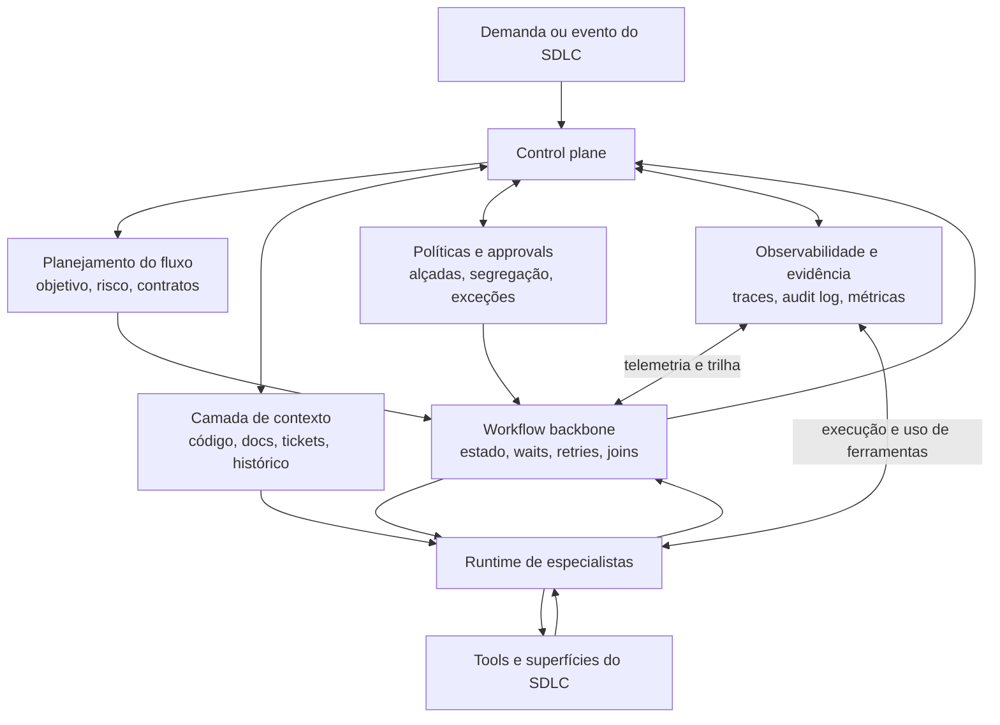

# Operating models e control plane para orquestração ponta a ponta

## Objetivo
Definir, em termos conceituais, como um sistema de orquestração de desenvolvimento assistido por IA deve ser organizado para coordenar especialistas, contexto, políticas e evidência ao longo do SDLC.

## Tese
### Inferência
As fontes mais fortes convergem menos para um "superagente" universal e mais para um operating model com quatro elementos integrados: contexto compartilhado, superfícies de trabalho do SDLC, guardrails operacionais e trilha auditável.

## Sinais observados nas fontes

### Fatos observados
- GitHub informa que sua revisão agentic recupera contexto de repositório, linked issues e histórico, e usa loop contínuo de avaliação para melhorar julgamento do agente. Fonte: GitHub Blog, 2026, https://github.blog/ai-and-ml/github-copilot/60-million-copilot-code-reviews-and-counting/
- GitLab descreve Intelligent Orchestration com unified data model, multi-agent orchestration, dynamic planning, confidence-scored decisioning, approvals, telemetry e policy-aligned workflows. Fonte: GitLab Blog, 2026, https://about.gitlab.com/blog/agentic-sdlc-gitlab-and-tcs-deliver-intelligent-orchestration-across-the-enterprise/
- GitLab documenta geração de audit event para cada requisição de API do Software Development Flow e explicita riscos de acesso a arquivos locais e tokens temporários. Fonte: GitLab Docs, 2026, https://docs.gitlab.com/user/duo_agent_platform/flows/foundational_flows/software_development/
- Atlassian posiciona Teamwork Graph como data intelligence layer que unifica dados, aprende contexto e aplica controles de acesso de última milha. Fonte: Atlassian Teamwork Graph, 2026, https://www.atlassian.com/platform/teamwork-graph
- Thoughtworks afirma que AI-first software delivery deve integrar requisitos, design, desenvolvimento, testes, deploy e manutenção, mas sempre com forte engineering oversight. Fonte: Thoughtworks, 2026, https://www.thoughtworks.com/en-us/insights/looking-glass/looking-glass-2026/AI-and-software-delivery

## Quatro camadas do operating model

### 1. Camada de contexto
#### Proposta conceitual
Responsável por consolidar e governar:
- código e histórico
- backlog, issues, PRs e MRs
- documentação e decisões arquiteturais
- políticas e restrições de risco
- telemetry operacional e feedback de produção

Sem essa camada, especialistas atuam cegamente e o orquestrador vira apenas roteador de prompts.

### 2. Camada de coordenação de fluxo
#### Proposta conceitual
Responsável por:
- decompor objetivos em etapas
- selecionar especialistas por capacidade e risco
- definir plano e ordem de execução
- abrir paralelismo apenas quando contratos permitirem
- consolidar resultados parciais
- detectar conflito, baixa confiança ou falta de evidência

### 3. Camada de controle e governança
#### Proposta conceitual
Responsável por:
- políticas por tipo de ação
- alçadas de autonomia
- checkpoints humanos
- trilha auditável
- retenção de evidência
- controle de acesso e redaction

### 4. Camada de avaliação e aprendizado
#### Proposta conceitual
Responsável por:
- medir aderência a contrato
- rastrear retrabalho e escalonamento
- comparar resultado esperado vs observado
- alimentar melhoria do fluxo, prompts, contratos e políticas

## Funções especializadas que o control plane deve coordenar

### Proposta conceitual
- planejador
- analista de requisitos
- arquiteto
- implementador
- verificador de testes
- verificador de segurança
- avaliador de risco
- consolidador de evidência
- aprovador humano

## Regras de desenho derivadas da evidência

### Regra 1, separar coordenação de execução
#### Inferência
Quando o mesmo agente tenta planejar, executar, validar e aprovar, aumenta o risco de erro não detectado e de racionalização da própria saída.

### Regra 2, usar superfícies nativas do SDLC como pontos de controle
#### Inferência
Issue, merge request, pull request, pipeline, test report, SBOM e audit log devem ser vistos como interfaces nativas de controle, não apenas anexos.

### Regra 3, autonomia deve ser graduada por risco e reversibilidade
#### Inferência
Fluxos reversíveis e de baixo impacto suportam maior automação. Mudanças arquiteturais, segurança, compliance e release precisam de alçadas explícitas.

### Regra 4, o control plane precisa operar com confiança declarada, não implícita
#### Proposta conceitual
Cada decisão material do fluxo deve carregar nível de confiança, base de evidência e condição de escalonamento.

## Modelo conceitual de control plane

## Diagrama conceitual, interação entre control plane e runtimes

### Leitura do diagrama
#### Proposta conceitual
A interação correta não é “agente no centro chamando tudo”. O control plane classifica e governa, o workflow backbone preserva a durabilidade operacional, e o runtime especializado executa dentro de contratos e limites explícitos.

### Proposta conceitual
Um control plane robusto deve manter, para cada fluxo:
- intenção original
- plano de etapas
- especialistas convocados
- artefatos consumidos e gerados
- políticas aplicadas
- evidências de validação
- decisões humanas e automáticas
- métricas de custo, tempo, risco e retrabalho
- estado atual do fluxo

## Objetos mínimos do control plane

### Proposta conceitual
Para que a orquestração seja auditável e reutilizável, o control plane deve tratar como objetos mínimos de primeira classe:
- fluxo
- etapa
- contrato
- handoff
- artefato
- evidência
- política
- decisão
- exceção
- checkpoint humano
- estado

### Inferência
Sem esse núcleo mínimo, a organização tende a voltar para coordenação conversacional difusa, baixa comparabilidade entre fluxos e pouca capacidade de auditoria transversal.

## Tensão central
### Inferência
A principal tensão não está entre automação e manualidade, mas entre velocidade local e governança sistêmica. Ferramentas otimizadas para acelerar uma etapa podem degradar o sistema total se quebrarem contexto, rastreabilidade ou qualidade dos handoffs.

## Critério de qualidade do operating model
### Proposta conceitual
Um operating model de boa qualidade, nesta linha de pesquisa, é aquele que consegue ao mesmo tempo:
- acelerar etapas locais sem perder rastreabilidade sistêmica
- modular especialistas sem quebrar contexto e contratos
- aumentar autonomia apenas quando o risco e a reversibilidade permitirem
- preservar governança mesmo quando múltiplos especialistas atuarem em paralelo

## Conclusão
### Proposta conceitual
O framework futuro deve ser orientado a control plane. Especialistas são substituíveis, contratos, evidência, políticas e contexto compartilhado não são.
