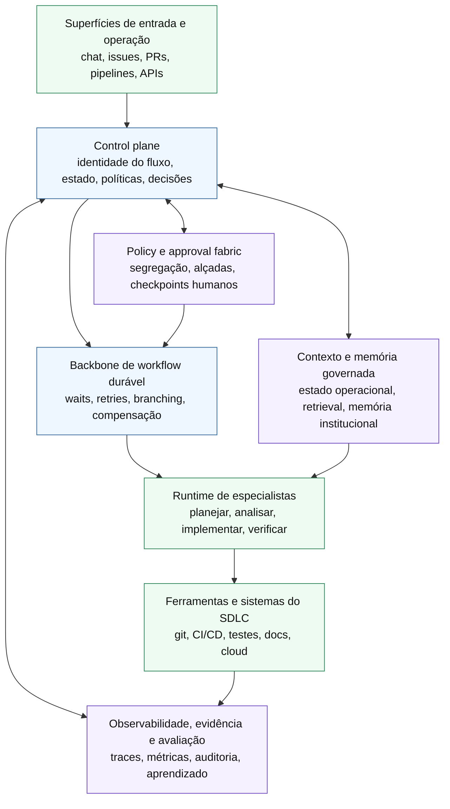

# Proposta de arquitetura-alvo para uma plataforma de orquestração agentic de software delivery

## Objetivo
Propor uma arquitetura-alvo, em nível conceitual, para uma plataforma orientada a orquestração do desenvolvimento de software assistido por IA. O foco aqui não é implementar agentes, mas definir a forma mais robusta de organizar camadas, responsabilidades, contratos, control plane, backbone de workflow, runtimes, memória, políticas, observabilidade, integrações e extensibilidade.

## Resposta curta
### Proposta conceitual
A arquitetura-alvo mais promissora é **composicional e control-plane-first**. Em vez de tratar o runtime de agentes como centro do sistema, a plataforma deve organizar:
1. **superfícies de entrada e operação**
2. **control plane de fluxo, política e identidade**
3. **backbone de workflow durável**
4. **runtime de agentes especialistas subordinado ao control plane**
5. **camada de contexto e memória governada**
6. **policy and approval fabric**
7. **observabilidade, avaliação e trilha de evidência**
8. **integrações nativas com sistemas do SDLC e operação**

### Inferência
Esse desenho preserva o principal aprendizado do benchmark: o valor estratégico não está em um agente único mais “inteligente”, mas em uma plataforma capaz de coordenar trabalho, contexto, risco, decisões e supervisão humana sem perder modularidade.

## Premissas arquiteturais

### Fatos observados
- Plataformas maduras convergem para contexto unificado, policy-aligned workflows, approvals, telemetry e auditabilidade como componentes explícitos.
- Workflow engines duráveis ganham relevância quando há long-running tasks, waits, retries, compensação, branching e retomada confiável.
- Runtimes de agentes são úteis para handoffs, tool calling e raciocínio especializado, mas não resolvem sozinhos governança sistêmica.
- Human-in-the-loop está se tornando primitive de plataforma, não exceção processual.

### Inferência
Portanto, a arquitetura-alvo deve partir de cinco premissas:
1. **coordenação e controle são preocupações de plataforma, não do agente individual**
2. **durabilidade operacional deve ficar fora do loop puro do LLM**
3. **memória útil precisa ser separada por função e governada por proveniência**
4. **política e aprovação devem ser aplicadas transversalmente**
5. **integrações com o SDLC precisam ser tratadas como interfaces nativas, não acessórios**

## Arquitetura-alvo em oito camadas

## Diagrama conceitual, arquitetura em camadas

### Leitura do diagrama
#### Proposta conceitual
O desenho deixa explícito que o runtime agentic não ocupa o centro administrativo da plataforma. O eixo do sistema é o control plane, apoiado por um backbone durável e cercado por capacidades transversais de contexto, policy, approval, observabilidade e evidência.

## 1. Camada de experiência e superfícies operacionais
### Proposta conceitual
É a camada onde usuários, times e sistemas iniciam, observam e intervêm nos fluxos.

**Superfícies típicas**
- chat operacional
- issue tracker
- pull request ou merge request
- pipeline UI
- catálogo interno de fluxos
- console de operações e auditoria
- APIs para disparo por evento

### Responsabilidade
Traduzir intenções e eventos em objetos de fluxo governados, sem embutir lógica crítica de coordenação dentro da interface.

### Decisão de desenho
A interface deve ser intercambiável. O sistema não pode depender semanticamente de um único canal conversacional para existir.

## 2. Camada de identidade de fluxo e control plane
### Proposta conceitual
Esta é a camada central da arquitetura. O control plane deve ser o sistema de registro do trabalho agentic.

**Responsabilidades principais**
- criar e acompanhar a identidade de cada fluxo
- manter estado global, versão, criticidade e ownership
- selecionar políticas aplicáveis
- decidir qual backbone, runtime e integrações serão usados
- emitir contratos de etapa
- consolidar evidências e decisões
- registrar checkpoints, exceções e escalonamentos
- coordenar tenancy, auth e boundaries organizacionais

### Contratos mínimos que o control plane deve governar
- contrato de fluxo
- contrato de etapa
- contrato de handoff
- contrato de aprovação
- contrato de exceção
- contrato de evidência

### Inferência
Sem esse núcleo, o sistema tende a virar uma coleção de agentes, prompts e automações locais sem consistência transversal.

## 3. Camada de backbone de workflow durável
### Proposta conceitual
A plataforma precisa de uma espinha dorsal que trate execução longa, espera, retomada, retries, compensação e sinais externos como capacidades nativas.

**Funções esperadas**
- persistência do estado do fluxo
- branching e join explícitos
- pausa para aprovação humana
- espera por evento externo
- reexecução controlada
- timeouts, retries e compensações
- retomada após falha de infraestrutura

### Comparação de alternativas conceituais
**Workflow engine dedicado como backbone**
- ponto forte: maior confiabilidade operacional, estado explícito e waits longos mais limpos
- ponto fraco: mais peso arquitetural e maior disciplina de modelagem

**Runtime agentic stateful tentando absorver workflow**
- ponto forte: menor fragmentação inicial e raciocínio mais perto da execução
- ponto fraco: tende a misturar lógica cognitiva com durabilidade operacional

### Recomendação
### Recomendação de desenho futuro
Para uma plataforma orientada a software delivery corporativo, o backbone preferível é um **workflow layer durável subordinado ao control plane**, não o próprio runtime de agentes.

## 4. Camada de runtime de agentes especialistas
### Proposta conceitual
O runtime de agentes deve ser tratado como camada de execução cognitiva, não como centro administrativo da plataforma.

**Funções próprias**
- interpretar contrato de etapa
- recuperar contexto autorizado
- usar ferramentas com schema explícito
- produzir saída estruturada
- declarar confiança, lacunas e necessidade de escalonamento
- executar handoffs entre especialistas quando permitido

**Funções que não devem residir principalmente aqui**
- estado canônico do fluxo
- política organizacional final
- aprovações obrigatórias
- trilha auditável global
- roteamento corporativo entre domínios e tenants

### Regra estrutural
Cada especialista deve operar como unidade substituível, com capacidade delimitada e interface estável. Isso reduz lock-in em frameworks de agentes e facilita evolução por composição.

## 5. Camada de contexto, memória e conhecimento governado
### Proposta conceitual
A arquitetura-alvo deve separar memória por papel operacional, porque “mais contexto” não equivale a “melhor contexto”.

### Tipos de memória a separar
1. **estado operacional do fluxo**
   - plano atual
   - etapas concluídas
   - exceções
   - decisões e aprovações

2. **memória de trabalho da execução**
   - contexto curto da run
   - histórico local necessário ao especialista
   - rascunhos e raciocínios intermediários que precisem ser retidos

3. **memória de conhecimento recuperável**
   - código, docs, ADRs, runbooks, tickets, testes, políticas, incidentes

4. **memória institucional e normativa**
   - padrões aprovados
   - exceções históricas
   - decisões recorrentes
   - feedback pós-implementação
   - learnings de avaliação

### Regras de desenho
- memória deve ter **proveniência**, **escopo**, **prazo de retenção** e **classe de sensibilidade**
- memória operacional e normativa não devem ser confundidas
- contexto recuperado deve ser citável e verificável sempre que influenciar decisão material
- acesso deve seguir mínimo privilégio por etapa e por especialista

### Inferência
Essa separação é decisiva para evitar contexto opaco, drift de comportamento e uso indevido de conhecimento sensível.

## 6. Camada de policy, approval e governança decisória
### Proposta conceitual
Policy enforcement deve atravessar toda a arquitetura, mas sua coordenação deve permanecer no control plane.

**Responsabilidades principais**
- mapear alçadas de autonomia por risco, impacto e reversibilidade
- exigir aprovação humana em transições críticas
- aplicar segregação de funções
- bloquear ações fora do escopo contratado
- impor redaction, secrets handling e data boundaries
- registrar justificativas de exceção

### Modelo recomendado
**Governança orientada a risco e reversibilidade**
- baixo risco e alta reversibilidade: maior autonomia automatizada
- risco moderado: automação com checkpoints amostrais ou condicionais
- alto risco ou baixa reversibilidade: aprovação humana mandatória

### Regra crítica
O mesmo agente não deve acumular, em etapas críticas, planejamento, execução, validação e aprovação final sem contrapeso externo.

## 7. Camada de observabilidade, avaliação e evidência
### Proposta conceitual
A plataforma precisa observar não apenas outputs finais, mas a trajetória do trabalho agentic.

**Objetos observáveis**
- spans e traces por fluxo, etapa e ferramenta
- custos, latência e uso de modelos
- handoffs entre especialistas
- decisões automáticas e humanas
- confiança declarada
- evidências usadas
- falhas, retrabalho e escalonamentos
- impactos em qualidade de engenharia e operação

### Avaliação em duas frentes
**Avaliação operacional online**
- aderência a contrato
- taxa de retrabalho
- incidentes por classe de fluxo
- regressões, rollback e exceções

**Avaliação offline e comparativa**
- datasets de casos
- cenários de regressão
- comparação de prompts, políticas, runtimes e fornecedores
- análise de custo versus resultado

### Inferência
Sem essa camada, a plataforma até pode parecer produtiva, mas opera sem capacidade séria de auditoria, benchmarking interno ou aprendizado sistêmico.

## 8. Camada de integração e extensibilidade
### Proposta conceitual
A arquitetura deve expor interfaces estáveis tanto para consumir quanto para oferecer capacidades.

**Integrações prioritárias**
- git, PR/MR e code review
- issues, backlog e planejamento
- CI/CD, testes, artefatos e SBOM
- documentação, wiki e ADRs
- secrets, identity e policy stores
- cloud, observability e incident systems
- chatops e notificações

**Superfícies de extensibilidade**
- catálogo de ferramentas com schemas versionados
- catálogo de especialistas ou skills
- adapters de contexto e retrieval
- policies pluggable
- adapters de evaluation e tracing
- conectores de workflow backbone
- multiple model providers

### Princípio de desenho
A extensibilidade deve ocorrer por contrato e catálogo, não por acoplamento direto a prompts ou integrações implícitas.

## Componentes conceituais mínimos

### Proposta conceitual
Uma plataforma realmente útil para decisões arquiteturais deveria prever ao menos os seguintes componentes:
- portal ou superfícies de entrada
- control plane
- registry de fluxos e capacidades
- state store canônico do fluxo
- workflow backbone durável
- runtime de especialistas
- tool registry com schemas e auth policy
- context fabric e knowledge access layer
- policy engine
- approval service ou fabric
- evidence store
- tracing e observability stack
- evaluation stack
- integration gateway para sistemas do SDLC

## Interfaces e contratos prioritários

### Proposta conceitual
A arquitetura-alvo depende mais de contratos estáveis do que de uma tecnologia específica. Os contratos mais importantes são:

### 1. Contrato de fluxo
Define objetivo, escopo, criticidade, atores, critérios de sucesso, restrições e políticas-base.

### 2. Contrato de etapa
Define entrada autorizada, saída esperada, evidência requerida, ferramentas permitidas, limite de autonomia e condições de escalonamento.

### 3. Contrato de handoff
Define o que um especialista entrega ao próximo, em que formato, com quais garantias e com que incertezas declaradas.

### 4. Contrato de evidência
Define quais provas sustentam uma decisão, seu grau de confiança e sua origem.

### 5. Contrato de aprovação
Define quem pode aprovar, em que condições, com que segregação de função e com qual trilha de justificativa.

### 6. Contrato de política
Define regras aplicáveis por classe de ação, risco, domínio de dados, ambiente e tipo de mudança.

### Inferência
Esses contratos são o principal antídoto contra handoffs difusos, excesso de contexto informal e automação pouco auditável.

## Responsabilidades do control plane

### Proposta conceitual
O control plane deve ser responsável por:
- identidade do fluxo e de suas revisões
- classificação de risco e escolha de política
- criação, suspensão, retomada e encerramento de fluxos
- despacho para backbone e runtimes adequados
- registro canônico de estado, decisão e evidência
- governança de tenancy, auth e limites de acesso
- coordenação de approvals e escalonamentos
- observabilidade transversal e exportação de trilha auditável
- desacoplamento entre experiência de uso e execução interna

### O que o control plane não deve absorver
- lógica detalhada de cada especialista
- armazenamento indiscriminado de toda memória de conhecimento
- avaliação exclusivamente baseada em output final
- dependência rígida de um único framework de agentes

## Escolhas estruturais mais importantes

## Escolha 1, backbone de workflow separado do runtime agentic
### Recomendação de desenho futuro
Separar explicitamente o plano de execução durável da camada de raciocínio dos agentes.

## Escolha 2, agent runtime abaixo do control plane
### Recomendação de desenho futuro
Tratar agentes como executores especializados governados por contratos, não como donos do sistema.

## Escolha 3, memória particionada por função
### Recomendação de desenho futuro
Separar estado operacional, working memory, retrieval de conhecimento e memória institucional.

## Escolha 4, policy e approval como capacidades transversais
### Recomendação de desenho futuro
Evitar que aprovações e guardrails sejam implementados apenas como lógica local de fluxo.

## Escolha 5, observabilidade e avaliação desde o início
### Recomendação de desenho futuro
A plataforma deve nascer preparada para explicar por que decidiu, o que executou, quanto custou e onde falhou.

## Build versus compose

## Tese
### Inferência
Para esse espaço de problema, a decisão não é binária entre “construir tudo” e “comprar tudo”. A arquitetura mais racional tende a **compor a maior parte da pilha e construir apenas o núcleo diferenciador**.

## O que tende a ser melhor compor
- workflow backbone durável
- runtimes de agentes generalistas
- tracing e evaluation stack
- conectores para sistemas padrão de mercado
- model providers e embeddings

## O que tende a ser melhor construir ou consolidar como IP próprio
- control plane orientado ao operating model da organização
- contratos de fluxo, handoff, evidência e aprovação
- matriz de autonomia por risco
- policy model específico do negócio
- integração semântica entre artefatos do SDLC, contexto e governança
- camada de decisão sobre despacho entre especialistas, políticas e fluxos

## Critério de decisão
### Inferência
A organização deve construir quando o componente carregar diferenciação de governança, operating model ou coordenação entre domínios. Deve compor quando o componente for commodity operacional já maduro e trocável por interface.

## Comparação de arquiteturas candidatas

### Opção A, agent-framework-centric
**Descrição**: usar um framework de agentes como eixo central e acoplar o resto ao redor.

**Vantagens**
- início mais rápido
- menor fricção para protótipos
- boa ergonomia para handoffs locais

**Limites**
- governança sistêmica tende a ficar fraca
- durabilidade e auditabilidade podem virar remendos
- maior risco de lock-in conceitual ao runtime

### Opção B, workflow-centric
**Descrição**: usar workflow durável como espinha dorsal e encaixar agentes como workers especializados.

**Vantagens**
- estado e retomada mais robustos
- approvals e waits mais naturais
- melhor encaixe para fluxos corporativos longos

**Limites**
- risco de rigidez excessiva
- pode tratar trabalho cognitivo como steps simplistas demais

### Opção C, control-plane-centric
**Descrição**: usar um control plane como camada dominante, com workflow backbone, agent runtime, policy e observability subordinados.

**Vantagens**
- melhor governança sistêmica
- separação mais clara entre coordenação, execução e supervisão
- maior flexibilidade para trocar runtimes e fornecedores
- melhor base para multi-team, multi-tenant e múltiplos tipos de fluxo

**Limites**
- maior complexidade de desenho
- exige disciplina forte de contratos e boundaries

### Recomendação
### Recomendação de desenho futuro
A arquitetura-alvo recomendada para este repositório é a **Opção C, control-plane-centric**, com workflow backbone separado e runtime agentic subordinado.

## O que essa arquitetura habilita melhor

### Inferência
Esse desenho melhora especialmente:
- coordenação ponta a ponta entre múltiplas etapas do SDLC
- governança orientada a risco
- substituição de especialistas e fornecedores sem redesenhar tudo
- auditoria por fluxo, decisão, política e evidência
- paralelismo controlado com joins explícitos
- integração com superfícies reais de trabalho de engenharia
- evolução incremental da plataforma sem recomeçar a arquitetura

## Riscos e tensões que permanecem

### Inferência
Mesmo com boa arquitetura, permanecerão tensões relevantes:
- overhead operacional maior que em demos agentic simples
- necessidade de curadoria contínua de contratos e políticas
- risco de burocratização excessiva do fluxo
- dificuldade de medir valor sistêmico no início
- pressão para recentralizar tudo em um vendor ou framework

## Conclusão

### Inferência
A arquitetura-alvo mais forte para software delivery assistido por IA não é um runtime de agentes expandido até virar plataforma. É uma plataforma de orquestração com **control plane forte, workflow durável, agentes especialistas subordinados, memória governada, policy e approval fabric, observabilidade profunda e integrações nativas com o SDLC**.

### Proposta conceitual
Essa arquitetura oferece a melhor base para futura implementação sem trair a tese central deste repositório: em ambientes reais, a vantagem competitiva está menos em gerar mais conteúdo e mais em coordenar trabalho, evidência, risco e decisão de forma confiável.