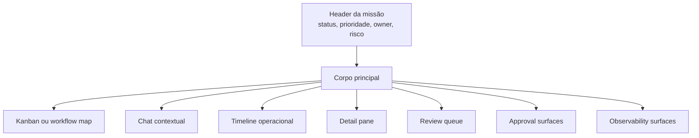
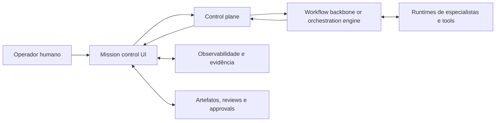

# Mission control, cockpit operacional e arquitetura de interface

## Objetivo
Definir a arquitetura conceitual da interface de missão e operação acima do orchestration engine, deixando claro como operadores humanos, aprovadores e donos do trabalho devem enxergar, supervisionar e intervir no sistema.

## Tese central
### Inferência
Se o control plane é o sistema de registro e coordenação, a mission control UI é a superfície onde esse sistema se torna legível, auditável e acionável para humanos.

### Proposta conceitual
A UI não deve ser apenas um chat com agentes. Ela deve funcionar como **cockpit operacional**: um ponto de observação e intervenção sobre missão, workflow, tasks, artefatos, revisões, aprovações, evidências e exceções.

## Princípios orientadores da interface

### Proposta conceitual
1. **Mission-first, não chat-first**  
   A unidade primária de leitura deve ser a missão e seu progresso, não a conversa isolada.

2. **Estado antes de narrativa**  
   Conversas ajudam a explicar, mas o operador precisa ver estado, dependências, riscos e bloqueios com clareza.

3. **Intervenção humana explícita**  
   Aprovar, rejeitar, redirecionar, pausar, escalar e encerrar devem ser ações nativas.

4. **Observabilidade incorporada**  
   Timeline, evidência, custo, latência, handoffs e uso de ferramentas devem aparecer sem exigir investigação externa.

5. **Leitura multi-nível**  
   A UI deve permitir ver portfólio, missão, workflow, task e evento sem perder contexto.

## Funções que a mission control UI precisa cumprir

### Proposta conceitual
A interface deve permitir aos humanos:
- iniciar ou enquadrar missões
- acompanhar progresso agregado e detalhado
- entender quem está responsável por quê
- identificar bloqueios, exceções e decisões pendentes
- revisar artefatos e evidências
- conceder ou negar approvals
- executar handoffs humanos
- inspecionar observabilidade operacional
- reconstruir a história de uma missão
- encerrar com conclusão, ressalvas ou cancelamento

## Arquitetura conceitual da UI

### Proposta conceitual
A mission control UI deve ser composta por pelo menos sete superfícies integradas.

## 1. Visão de portfólio ou fila de missões
### Papel
Mostrar o conjunto de missões ativas, pendentes, bloqueadas, escaladas e concluídas.

### Deve destacar
- status agregado
- prioridade
- risco
- owner
- tempo em estado atual
- próxima decisão pendente
- quantidade de tasks abertas
- bloqueios e aprovações em espera

### Forma recomendada
Lista operacional com filtros, ordenação e agrupamentos por time, criticidade, estado ou tipo de fluxo.

## 2. Kanban de missão ou workflow board
### Papel
Expor o fluxo de trabalho em colunas legíveis por estado operacional.

### Colunas típicas
- captured ou qualified
- ready
- executing
- in_review
- awaiting_approval
- blocked
- escalated
- done

### Proposta conceitual
O kanban não substitui o engine. Ele oferece leitura humana das tasks e handoffs, ajudando a identificar acúmulo, gargalo e retrabalho.

## 3. Chat contextual da missão
### Papel
Permitir interação conversacional, mas ancorada no estado da missão.

### Deve servir para
- solicitar esclarecimentos
- emitir direcionamentos
- registrar decisões narrativas
- conversar com o orquestrador ou especialistas
- resumir mudança recente de estado

### Regra
Mensagens relevantes devem poder ser promovidas a objetos formais, como decisão, comentário de review, instrução de handoff ou pedido de aprovação.

## 4. Timeline operacional
### Papel
Reconstruir a sequência de eventos da missão.

### Deve incluir
- criação e qualificação da missão
- decomposição em tasks
- dispatch para agentes
- artefatos produzidos
- reviews, approvals e rejeições
- bloqueios, exceções e escalonamentos
- interações humanas e automáticas relevantes
- conclusão e pós-conclusão

### Inferência
Sem timeline, a plataforma perde capacidade de auditoria, aprendizagem e explicação do que realmente aconteceu.

## 5. Detail pane da missão ou da task
### Papel
Mostrar o objeto selecionado com profundidade operacional.

### Para missão, deve trazer
- objetivo
- owner e stakeholders
- workflow atual
- estado agregado
- critérios de sucesso
- riscos e políticas aplicáveis
- resumo executivo do progresso

### Para task, deve trazer
- objetivo local
- responsável atual
- entradas e saídas esperadas
- evidências registradas
- dependências
- histórico de review e approval
- condição de handoff

## 6. Review queue
### Papel
Concentrar itens aguardando avaliação humana ou validação estruturada.

### Deve listar
- objeto em review
- motivo da revisão
- risco
- evidência disponível
- prazo ou SLA esperado
- revisor responsável

### Regra
A review queue não deve depender de o usuário encontrar a missão manualmente. Itens críticos precisam emergir por prioridade e risco.

## 7. Approval surfaces
### Papel
Expor decisões que exigem autorização explícita.

### Exemplos
- aprovação de escopo
- aprovação de desenho
- aprovação para merge ou release
- aprovação de exceção de policy
- aceitação de risco residual

### Cada surface de approval deve mostrar
- decisão pedida
- impacto
- reversibilidade
- evidência que sustenta o pedido
- alternativas ou tradeoffs quando existirem
- consequência de aprovar, rejeitar ou devolver

## 8. Observability surfaces
### Papel
Permitir leitura operacional e diagnóstica da execução.

### Devem incluir
- tracing por missão, task, agent e ferramenta
- tempo em cada estado
- custo por missão ou etapa
- consumo de modelos e ferramentas
- retries, falhas e compensações
- cobertura de evidência
- taxa de retrabalho e escalonamento

### Proposta conceitual
Essas superfícies devem ser acessíveis a partir da missão, e não isoladas como um sistema paralelo reservado apenas à engenharia de plataforma.

## Layout conceitual do cockpit

### Leitura do layout
#### Proposta conceitual
O cockpit deve combinar visão de fluxo, contexto narrativo, histórico, decisão e diagnóstico. Nenhuma superfície sozinha é suficiente.

## Interação entre UI e orchestration engine

### Proposta conceitual
A UI deve interagir com o engine por eventos, comandos e consultas de estado.

### O engine deve fornecer para a UI
- estado canônico da mission e das tasks
- eventos de transição
- tarefas pendentes de review e approval
- evidências e artefatos associados
- métricas de execução e observabilidade
- alertas de bloqueio, exceção e escalonamento

### A UI deve poder enviar ao engine
- criação ou ajuste de missão
- confirmação de dados faltantes
- decisões de approval ou rejeição
- comentários de review
- mudança de prioridade ou owner
- pausa, retomada ou cancelamento
- instruções de handoff humano
- comandos de escalonamento

### Regra central
A UI não deve alterar o estado por convenção implícita. Toda intervenção humana relevante precisa virar evento ou comando explícito no modelo do sistema.

## Diagrama conceitual, interação UI, control plane e engine

### Leitura do diagrama
#### Proposta conceitual
O operador não deveria interagir diretamente com o runtime efêmero do especialista como fonte principal de verdade. A UI deve se apoiar no control plane e no estado durável do workflow.

## Modelo de navegação recomendado

### Proposta conceitual
A navegação ideal tem quatro níveis:
1. **portfólio**: lista e filtros de missões
2. **missão**: visão agregada com progresso, risco e decisões
3. **task**: detalhe da unidade de trabalho e seu histórico
4. **evento ou artefato**: nível forense para auditoria e diagnóstico

### Inferência
Esse desenho evita dois extremos ruins: a abstração alta demais, que esconde o que ocorreu, e o detalhe cru demais, que impede leitura operacional rápida.

## Como o cockpit deve apresentar estados e exceções

### Proposta conceitual
O cockpit precisa diferenciar visualmente pelo menos:
- progresso normal
- bloqueio por dependência
- review pendente
- approval pendente
- conflito entre especialistas
- policy mismatch
- risco elevado
- missão concluída com restrições

### Regra
Exceções devem ser explicáveis. O usuário precisa ver não apenas que algo falhou, mas o que faltou, quem está responsável e qual é o próximo passo possível.

## Como o cockpit deve lidar com chat

### Inferência
Chat é útil para coordenação e explicação, mas é frágil como único mecanismo de gestão do trabalho.

### Proposta conceitual
O chat da missão deve ser tratado como uma superfície auxiliar com três funções:
- contextualizar estado
- permitir instruções humanas rápidas
- capturar raciocínio ou decisão que depois pode ser estruturado

### Não deve fazer sozinho
- representar o workflow
- concentrar approvals críticos sem superfície própria
- esconder histórico de artefatos e evidências
- substituir timeline ou queue operacional

## Filas operacionais recomendadas

### Proposta conceitual
Além da visão por missão, a UI deveria suportar filas transversais para:
- reviews pendentes
- approvals pendentes
- missões bloqueadas
- missões escaladas
- tarefas sem owner claro
- handoffs aguardando aceite
- exceções por policy

### Inferência
Filas transversais são essenciais para operação real, porque humanos raramente trabalham navegando missão por missão de forma sequencial.

## Personas e leituras diferentes

### Proposta conceitual
A mesma base de UI deve acomodar ao menos quatro leituras:
1. **operador de missão**: acompanha fluxo, bloqueios e coordena intervenção
2. **owner de negócio ou engenharia**: acompanha progresso agregado, risco e resultado
3. **revisor ou aprovador**: entra pela fila de review ou approval
4. **equipe de plataforma**: inspeciona observabilidade, uso e padrões de exceção

## Anti-padrões da interface

### Inferência
São sinais de cockpit fraco:
- interface reduzida a um único chat
- ausência de fila de reviews e approvals
- timeline incompleta ou inexistente
- impossibilidade de diferenciar estado da missão e estado técnico da task
- observabilidade separada demais da experiência principal
- aprovação crítica sem evidência visível
- kanban sem semântica de risco, bloqueio ou ownership

## Recomendação de evolução futura

### Recomendação de desenho futuro
Na próxima fase, a arquitetura de UI deveria ser refinada em:
1. mapa de informações por persona
2. catálogo formal de telas ou superfícies
3. contrato de eventos UI para control plane e engine
4. taxonomia visual de estados, riscos, bloqueios e exceções

## Conclusão

### Proposta conceitual
Mission control deve ser entendida como a camada de operação humana do sistema agentic. Ela transforma o plano de controle em uma experiência supervisível, auditável e útil.

### Inferência
Sem cockpit operacional, uma plataforma de orquestração tende a parecer mágica quando tudo funciona e ilegível quando algo importante falha. A UI certa não é cosmética. Ela é parte da governança.