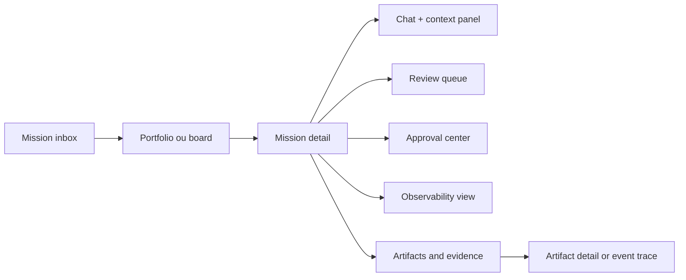
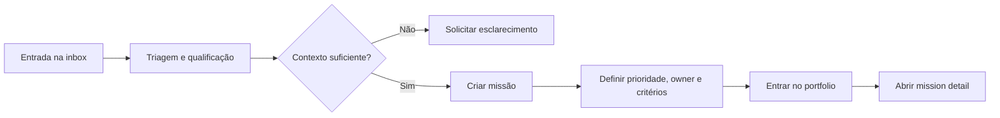
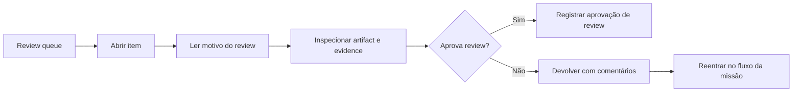
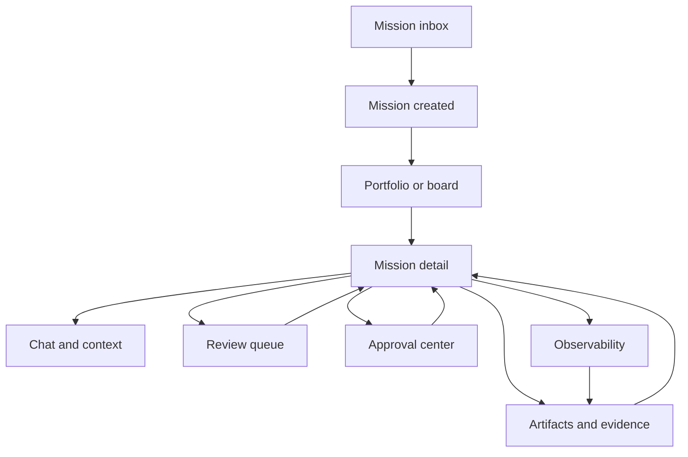

# Visão de produto da interface, jornadas e wireframes conceituais

## Objetivo
Traduzir a arquitetura conceitual de mission control em uma visão de experiência de produto voltada a usuários, cobrindo telas principais, jornadas, fluxos de interação e wireframes conceituais da plataforma de orquestração.

## Papel deste documento
### Proposta conceitual
O documento anterior definiu o cockpit como superfície operacional acima do control plane. Este documento aprofunda a visão de experiência do produto, deixando mais claro como pessoas entram, navegam, decidem, supervisionam e explicam o trabalho executado por missões, workflows, especialistas e filas operacionais.

## Tese de experiência
### Inferência
Uma plataforma de orquestração útil não parece um painel técnico disfarçado de produto. Ela precisa oferecer uma experiência em que o usuário consiga, com pouco atrito:
- entender o que está acontecendo
- identificar o que exige ação humana
- intervir com segurança
- navegar entre resultado, contexto, evidência e operação
- reconstruir a história de uma missão sem depender de memória informal

### Proposta conceitual
A experiência deve combinar três modos de leitura em uma mesma linguagem:
1. **coordenação de trabalho**
2. **colaboração com agentes**
3. **governança e evidência**

## Princípios de experiência do produto

### Proposta conceitual
1. **Começar por trabalho, não por ferramenta**  
   O usuário entra por missões, filas, prioridades e exceções, não por modelos, runtimes ou detalhes internos.

2. **Atenção guiada por relevância**  
   A interface deve fazer emergir bloqueios, reviews, aprovações, risco e desvios sem exigir caça manual.

3. **Contexto persistente ao navegar**  
   Ao mudar de tela, o usuário não deve perder o objetivo da missão, estado atual, risco, owner e últimos eventos relevantes.

4. **Ação humana explícita e reversível quando possível**  
   Aprovar, devolver, pausar, redirecionar, escalar e encerrar devem ter impacto legível e trilha de evidência.

5. **Explicabilidade embutida**  
   Toda decisão importante deve poder ser explicada pela combinação de estado, chat, artefatos, evidências e timeline.

6. **Profundidade progressiva**  
   A leitura deve funcionar do resumo executivo ao nível forense, sem sobrecarregar a tela inicial.

## Modelo conceitual de navegação



### Leitura recomendada
#### Proposta conceitual
- **mission inbox** concentra entrada, triagem e priorização
- **portfolio ou board** organiza o conjunto vivo de missões
- **mission detail** é a superfície principal de operação
- **chat + context panel** apoia coordenação e clarificação
- **review queue** e **approval center** concentram decisões humanas
- **observability view** oferece leitura diagnóstica
- **artifacts and evidence** sustenta auditabilidade e confiança

## Tela 1, mission inbox

### Papel
Ser a porta de entrada operacional para novas demandas, missões recém-chegadas, itens reabertos e exceções que precisam de enquadramento inicial.

### Perguntas que a tela responde
- o que chegou agora
- o que precisa ser qualificado
- o que está incompleto ou ambíguo
- o que merece abertura imediata como missão
- o que deve ser devolvido, fundido ou descartado

### Objetos principais
- item de entrada
- origem
- resumo do objetivo
- completude do contexto
- risco inicial
- recomendação de enquadramento
- ações de triagem

### Ações primárias
- criar missão
- pedir esclarecimento
- fundir com missão existente
- classificar prioridade
- marcar como fora de escopo
- encaminhar para fila especializada

### Wireframe conceitual

```text
+-----------------------------------------------------------------------------------+
| Mission Inbox                         filtros | origem | prioridade | risco        |
+-----------------------------------------------------------------------------------+
| New / Needs triage (24)                                                        |
|-----------------------------------------------------------------------------------|
| [Item] API release blocked by missing test evidence                              |
| origem: Jira   prioridade sugerida: alta   risco inicial: médio                  |
| contexto: parcial   recomendação: abrir missão de validação                       |
| ações: [Criar missão] [Pedir contexto] [Fundir] [Descartar]                      |
|-----------------------------------------------------------------------------------|
| [Item] Customer escalation about failed onboarding flow                           |
| origem: Slack   prioridade sugerida: alta   risco inicial: alto                  |
| contexto: suficiente   recomendação: abrir missão de incident response            |
| ações: [Criar missão] [Escalar] [Atribuir owner]                                 |
+-----------------------------------------------------------------------------------+
```

### Regra de experiência
#### Proposta conceitual
A inbox deve funcionar como estação de enquadramento. Ela não é backlog genérico, nem apenas caixa de mensagens.

## Tela 2, portfolio ou board view

### Papel
Dar visão agregada do portfólio de missões ativas, pendentes, bloqueadas, em revisão, aguardando approval e concluídas.

### Modos conceituais da mesma tela
- **lista operacional** para leitura rápida e filtros complexos
- **board por estado** para identificar gargalos
- **agrupamento por owner, time, workflow ou criticidade**

### Informações mínimas por missão
- nome e objetivo curto
- estado atual
- risco
- owner
- idade da missão
- tempo no estado atual
- próxima decisão pendente
- número de tasks abertas
- cobertura de evidência

### Wireframe conceitual, modo board

```text
+------------------------------------------------------------------------------------------------+
| Mission Portfolio                                busca | filtros | agrupamento | SLA | risco    |
+------------------------------------------------------------------------------------------------+
| Captured            Ready               Executing            In review            Awaiting app |
|------------------  ------------------  -------------------  -------------------  -------------|
| Mission A          Mission C           Mission F            Mission H            Mission J     |
| owner: Ana         owner: Ravi         owner: Jo            risk: medium         risk: high    |
| risk: medium       age: 2h             blocked deps: 1      reviewer: Mia        approver: CTO|
|------------------  ------------------  -------------------  -------------------  -------------|
| Blocked            Escalated           Done                                                    |
|------------------  ------------------  --------------------------------------------------------|
| Mission D          Mission K           Mission B, E, G...                                      |
| cause: policy      waiting exec input                                                       |
+------------------------------------------------------------------------------------------------+
```

### Regra de experiência
#### Inferência
O board deve ser um instrumento de leitura operacional, não apenas um kanban estético. Colunas precisam carregar semântica de risco, bloqueio, approval e aging.

## Tela 3, mission detail

### Papel
Ser a tela central de operação da missão. É onde o usuário entende o objetivo, acompanha progresso, inspeciona workflow, vê bloqueios, conversa, revisa artefatos e toma decisões.

### Estrutura conceitual da tela
- cabeçalho persistente da missão
- trilha de progresso e estado
- área principal com fluxo e atividade recente
- painel lateral de contexto e decisões
- acesso rápido a artifacts, evidence, review, approvals e observability

### Wireframe conceitual

```text
+================================================================================================+
| Mission: Stabilize release candidate before production                                          |
| status: Executing | priority: High | risk: Medium | owner: Platform Ops | age: 3d             |
| goal: Recover confidence for release decision with complete evidence and approvals              |
+================================================================================================+
| Workflow / progress                                  | Context / decisions                     |
|------------------------------------------------------|-----------------------------------------|
| [Qualify]--[Plan]--[Execute]--[Review]--[Approve]    | Success criteria                        |
|                 current: Execute                     | Risks                                   |
|                                                      | Policies                                |
| Active tasks                                         | Next required decision                  |
| - test evidence consolidation                        | Stakeholders                            |
| - dependency verification                            | Linked missions                         |
| - release note review                                |                                         |
|                                                      |                                         |
| Recent activity                                      | Quick actions                           |
| - agent synthesized missing evidence                 | [Pause] [Redirect] [Escalate]           |
| - reviewer requested stronger traceability           | [Request approval] [Close mission]      |
+================================================================================================+
| Tabs: Overview | Chat | Timeline | Artifacts | Evidence | Reviews | Approvals | Observability  |
+================================================================================================+
```

### Regra de experiência
#### Proposta conceitual
Mission detail deve ser a superfície em que estado, narrativa e governança se encontram. Se a tela exigir múltiplas navegações para responder “o que está acontecendo e o que eu faço agora”, ela falha.

## Tela 4, chat + context panel

### Papel
Permitir colaboração conversacional sem perder ancoragem no estado da missão e nos objetos formais.

### O que o chat deve suportar
- instruções ao orquestrador
- pedidos de resumo e explicação
- esclarecimento de escopo
- registro narrativo de decisão
- promoção de mensagem para tarefa, review, approval ou risco

### O que o context panel deve manter visível
- objetivo atual
- status
- task selecionada
- artefatos citados
- riscos ativos
- políticas relevantes
- participantes e responsáveis

### Wireframe conceitual

```text
+-----------------------------------------------------------------------------------+
| Chat da missão                                        | Context panel             |
|-----------------------------------------------------------------------------------|
| User: What is still missing for release approval?     | Mission status            |
| Orchestrator: Two items remain: test traceability     | Current task              |
| and sign-off from security review.                    | Risks                     |
|                                                       | Policies                  |
| User: Turn this into an approval request draft.       | Referenced artifacts      |
| Orchestrator: Draft prepared.                         | Pending reviews           |
|                                                       | Stakeholders              |
| [Type message...] [Attach context] [Promote to object]|                           |
+-----------------------------------------------------------------------------------+
```

### Regra de experiência
#### Proposta conceitual
O chat deve sempre ser capaz de apontar para objetos formais. Conversa sem vínculo estrutural cria opacidade e perda de auditabilidade.

## Tela 5, review queue

### Papel
Concentrar tudo o que precisa de revisão humana ou validação estruturada.

### Tipos conceituais de review
- revisão de artefato
- revisão de qualidade
- revisão de segurança
- revisão de consistência entre outputs
- revisão de exceção ou conflito

### Campos importantes
- item em revisão
- missão e task associadas
- motivo do review
- criticidade
- evidências disponíveis
- prazo esperado
- recomendação do sistema

### Wireframe conceitual

```text
+-----------------------------------------------------------------------------------+
| Review Queue                                      filtros | criticidade | prazo    |
+-----------------------------------------------------------------------------------+
| [High] Security review for onboarding changes                                      |
| mission: Customer onboarding recovery                                              |
| motivo: policy-sensitive change set                                                |
| evidence: 7 items | requester: orchestrator | SLA: today                           |
| ações: [Open review] [Assign reviewer] [Return with comments]                      |
|-----------------------------------------------------------------------------------|
| [Medium] UX copy review for release notes                                          |
| mission: Release candidate stabilization                                           |
| evidence: 3 items | recommendation: quick pass                                     |
| ações: [Approve review] [Request changes]                                          |
+-----------------------------------------------------------------------------------+
```

### Regra de experiência
#### Inferência
Reviews precisam emergir por risco e prazo. Não devem ficar escondidos dentro da missão esperando que alguém lembre de procurá-los.

## Tela 6, approval center

### Papel
Centralizar decisões formais que exigem autorização explícita.

### Tipos conceituais de approval
- aprovação de escopo
- aprovação de arquitetura ou desenho
- aprovação de merge ou release
- aprovação de exceção de policy
- aceitação de risco residual

### O que cada pedido de approval deve mostrar
- decisão pedida
- impacto e reversibilidade
- evidência principal
- alternativas consideradas
- consequência de aprovar, rejeitar ou devolver
- responsável por decidir

### Wireframe conceitual

```text
+================================================================================================+
| Approval Center                                                                  pending: 6    |
+================================================================================================+
| Request: Approve release candidate promotion                                                     |
| mission: Stabilize release candidate before production                                           |
| requested by: Platform Ops orchestrator                                                          |
| impact: production release                                                                       |
| reversibility: partial                                                                           |
| evidence summary: tests green, rollback ready, security review pending sign-off                 |
| tradeoffs: delay 24h for additional review vs release with accepted residual risk               |
|                                                                                                |
| Actions: [Approve] [Reject] [Return for more evidence] [Escalate]                               |
+================================================================================================+
```

### Regra de experiência
#### Proposta conceitual
Approval center deve reduzir ambiguidade decisória. Aprovar sem evidência, ou sem clareza sobre impacto e reversibilidade, é anti-padrão de produto e de governança.

## Tela 7, observability view

### Papel
Tornar a execução legível para diagnóstico operacional e melhoria contínua, sem separar demais a experiência de produto da experiência de plataforma.

### Perguntas que a tela responde
- onde a missão está gastando tempo
- quais agentes, ferramentas ou modelos foram usados
- onde houve retries, falhas ou compensações
- como custo, latência e retrabalho evoluíram
- que partes têm baixa cobertura de evidência

### Subvisões conceituais
- resumo executivo de saúde da missão
- tracing de missão e task
- mapa de estados e tempos
- custo e uso por etapa
- falhas, retries e exceções

### Wireframe conceitual

```text
+-----------------------------------------------------------------------------------+
| Observability: Mission health                                                     |
+-----------------------------------------------------------------------------------+
| Duration by state      | Cost by stage        | Exceptions                         |
| Execute: 14h           | Planning: $$         | 2 retries on artifact validation   |
| Review: 6h             | Review: $$$          | 1 policy mismatch                  |
| Approval: 1d waiting   | Evidence: $          | 0 unresolved runtime errors        |
|-----------------------------------------------------------------------------------|
| Trace                                                                             |
| Mission -> Task A -> Specialist X -> Tool Y -> Artifact Z -> Review -> Approval  |
+-----------------------------------------------------------------------------------+
```

### Regra de experiência
#### Proposta conceitual
Observability não deve viver apenas para especialistas de plataforma. Ela precisa ser traduzida em linguagem acionável para operadores de missão e owners.

## Tela 8, artifact and evidence navigation

### Papel
Oferecer navegação clara entre artefatos produzidos, evidências coletadas, versões, comentários, reviews relacionados e eventos de geração ou modificação.

### Objetos que a navegação deve conectar
- artefato
- versão
- origem
- task e missão vinculadas
- reviews relacionados
- approvals relacionados
- evidências de suporte
- eventos de criação, edição, validação e consumo

### Wireframe conceitual

```text
+================================================================================================+
| Artifacts and Evidence                                                                          |
+================================================================================================+
| Left rail                                  | Main pane                                           |
|--------------------------------------------|-----------------------------------------------------|
| Artifacts                                  | Artifact: Release readiness summary                 |
| - PRD summary                              | version: v4                                         |
| - Test evidence bundle                     | linked task: evidence consolidation                 |
| - Release readiness summary                | status: reviewed                                    |
| - Security sign-off                        |                                                     |
|                                            | Related evidence                                    |
| Evidence                                   | - CI results                                        |
| - Trace logs                               | - reviewer comments                                 |
| - CI reports                               | - approval request                                  |
| - Human comments                           | - execution trace                                   |
|                                            |                                                     |
| Timeline                                   | Actions: [Open source event] [Compare versions]     |
+================================================================================================+
```

### Regra de experiência
#### Inferência
Quando artifact e evidence navigation são fracos, a plataforma perde confiança. Usuários passam a tratar outputs do sistema como opacos ou difíceis de justificar.

## Jornada 1, da entrada à missão ativa

### Objetivo da jornada
Transformar um item bruto em missão qualificada e pronta para execução.



### Momentos críticos
- identificar incompletude de contexto cedo
- evitar criar missão ambígua demais
- registrar critérios de sucesso antes da execução

## Jornada 2, condução de uma missão em execução

### Objetivo da jornada
Permitir que operador ou owner acompanhe progresso, entenda bloqueios e redirecione o trabalho quando necessário.

### Fluxo conceitual
1. abrir mission detail a partir do board ou inbox
2. ler estado, progresso e atividades recentes
3. abrir chat para pedir resumo ou redirecionar
4. inspecionar task ou artifact relevante
5. verificar se há reviews ou approvals pendentes
6. tomar ação, pausar, escalar ou deixar seguir

### Regra de experiência
#### Proposta conceitual
A jornada deve ser curta para perguntas frequentes, mas profunda o bastante para investigação quando há risco ou exceção.

## Jornada 3, revisão humana de um output

### Objetivo da jornada
Permitir review estruturado com contexto suficiente e baixa ambiguidade.



### Boas propriedades da jornada
- entrada pela fila, não por busca manual
- acesso direto a evidências
- comentários estruturados, não apenas texto solto

## Jornada 4, decisão de approval

### Objetivo da jornada
Oferecer base suficiente para uma decisão de alto impacto sem exigir investigação paralela dispersa.

### Fluxo conceitual
1. entrar pelo approval center ou alerta contextual
2. ler decisão solicitada
3. entender impacto, reversibilidade e tradeoffs
4. abrir evidência essencial
5. aprovar, rejeitar, devolver ou escalar
6. registrar decisão como evento formal

### Regra de experiência
#### Inferência
Approval é menos sobre clique e mais sobre responsabilidade legível. A interface deve tornar isso evidente.

## Jornada 5, investigação de exceção ou falha

### Objetivo da jornada
Ajudar o usuário a explicar rapidamente por que uma missão travou, degradou ou foi escalada.

### Fluxo conceitual
1. alerta no board, timeline ou mission detail
2. abrir observability view
3. identificar estado, ponto de falha e retries
4. navegar para task, artifact ou policy relacionada
5. tomar ação corretiva ou escalar

## Relação entre telas e modos de trabalho

| Tela ou superfície | Modo dominante | Pergunta principal |
|---|---|---|
| Mission inbox | triagem | o que precisa ser enquadrado agora |
| Portfolio ou board | coordenação | onde estão as missões e gargalos |
| Mission detail | operação | o que acontece nesta missão |
| Chat + context | colaboração | como orientar ou esclarecer |
| Review queue | validação | o que precisa de revisão humana |
| Approval center | decisão formal | o que precisa de autorização |
| Observability | diagnóstico | por que isso está assim |
| Artifacts and evidence | explicação | o que sustenta o resultado |

## Fluxo conceitual de interação entre superfícies



## Padrões de atenção e sinalização

### Proposta conceitual
A linguagem de interface deve sinalizar pelo menos:
- estado atual
- risco
- criticidade
- aging ou tempo parado
- ação humana requerida
- exceção de policy
- evidência insuficiente
- conclusão com ressalvas

### Regra
Sinalização visual deve reduzir ambiguidade, não aumentar ruído. O usuário precisa distinguir o urgente do importante e o importante do apenas informativo.

## Anti-padrões de experiência

### Inferência
Sinais de produto fraco incluem:
- chat como única navegação
- excesso de telas técnicas sem tradução para decisão humana
- approval escondido dentro de conversas
- review sem evidência acessível
- observability sem ligação com missão e task
- artifacts sem genealogia, versões ou vínculo com eventos
- board bonito mas incapaz de explicar bloqueios e aging

## Recomendações para próxima fase de desenho

### Recomendação de desenho futuro
Na fase seguinte, esta visão pode evoluir para:
1. arquitetura de informação formal por persona
2. matriz tela versus ação versus objeto de domínio
3. biblioteca conceitual de componentes e estados
4. taxonomia de alertas e exceções
5. especificação de eventos de UI e contratos com control plane
6. protótipos navegáveis de baixa fidelidade

## Conclusão

### Proposta conceitual
A experiência de mission control deve funcionar como a camada humana da orquestração. Ela não serve apenas para observar o trabalho dos agentes, mas para enquadrar, decidir, revisar, explicar e governar o fluxo ponta a ponta.

### Inferência
Se o control plane dá coerência ao sistema, a experiência de produto dá coerência ao uso humano desse sistema. Sem essa camada, a plataforma pode até executar trabalho, mas não consegue operar com confiança em escala.
