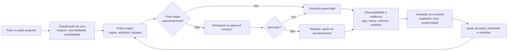

# Governança, segurança, qualidade e métricas

## Diagrama conceitual, loop de policy, approval e observabilidade

### Leitura do diagrama
O loop de governança não termina na aprovação. Policy, aprovação, execução observável e recalibração precisam formar um circuito contínuo, para que o sistema aprenda sem perder controle.

## Governança
A governança deve cobrir:
- policies de autonomia
- alçadas de decisão
- aprovação humana
- segregação de papéis
- versionamento de artefatos
- retenção de evidências

## Segurança
- proteção de código e segredo
- controle de acesso por contexto
- isolamento por ambiente
- validação de origem de artefatos
- prevenção de ações fora de policy

## Qualidade
- critérios objetivos de aceite por etapa
- validação cruzada quando necessário
- avaliação de consistência entre artefatos
- revisão humana em pontos críticos

## Métricas
### produtividade
- tempo até primeira versão útil
- throughput por tipo de demanda

### qualidade
- regressões
- defeitos em produção
- taxa de rollback

### risco
- incidentes por automação
- violações de policy
- decisões revertidas

### confiabilidade
- aderência do output ao contrato
- taxa de sucesso por etapa
- necessidade de intervenção humana
